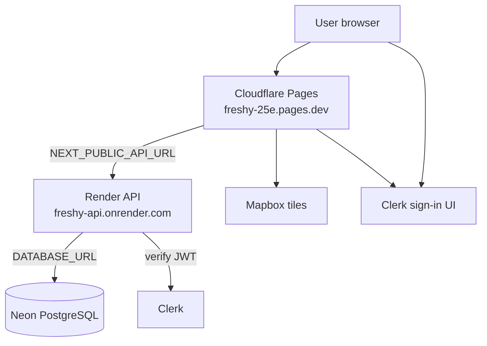
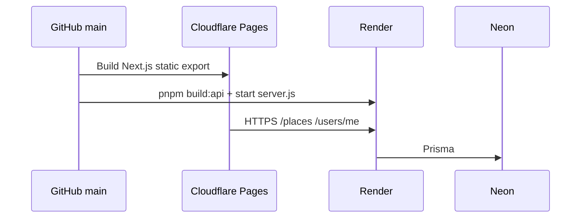
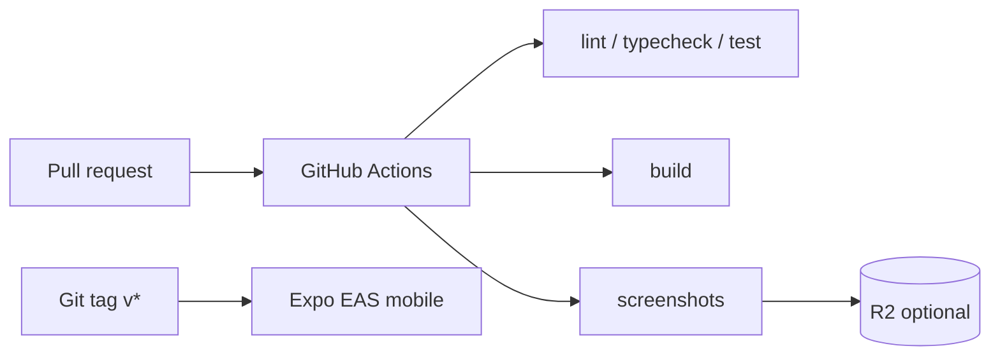

# Freshy

**Freshy** is a mobile-first cooling map: find air-conditioned refuges in hot cities.

**Live app:** https://freshy-25e.pages.dev/explore  
**Live API:** https://freshy-api.onrender.com

> **Platform checklist (Neon, Render, Pages, Clerk, Mapbox, …):** [docs/platforms.md](docs/platforms.md). Read this first when you forget where something is configured.

---

## What runs where (production today)

| Layer         | Provider                     | URL / dashboard                            |
| ------------- | ---------------------------- | ------------------------------------------ |
| **Web**       | Cloudflare Pages             | https://freshy-25e.pages.dev               |
| **API**       | Render (Node/Express)        | https://freshy-api.onrender.com            |
| **Database**  | Neon (Postgres 16 + PostGIS) | https://console.neon.tech                  |
| **Auth**      | Clerk                        | https://dashboard.clerk.com                |
| **Maps**      | Mapbox                       | https://account.mapbox.com                 |
| **Code & CI** | GitHub                       | https://github.com/alexandrelheinen/freshy |

Planned later: Cloudflare **Workers** + **Hyperdrive** for the API (replacing Render). See [docs/infrastructure.md](docs/infrastructure.md).

---

## Architecture (production)



---

## Deploy pipeline

Pushing to `main` triggers **Cloudflare Pages** (web) and **Render** (API) from GitHub.



Full platform details: [docs/platforms.md](docs/platforms.md).

---

## Repository structure

| Path              | Package          | Description                          |
| ----------------- | ---------------- | ------------------------------------ |
| `apps/web`        | `@freshy/web`    | Next.js PWA → **Cloudflare Pages**   |
| `apps/mobile`     | `@freshy/mobile` | Expo (Android & iOS, EAS, future)    |
| `packages/api`    | `@freshy/api`    | Express REST API → **Render** (prod) |
| `packages/db`     | `@freshy/db`     | Prisma + PostgreSQL (**Neon** prod)  |
| `packages/ui`     | `@freshy/ui`     | Shared React components              |
| `packages/config` | `@freshy/config` | ESLint + Tailwind tokens             |

Monorepo layout: [docs/architecture.md](docs/architecture.md).

---

## Documentation index

| Doc                                                                                      | When to read it                                             |
| ---------------------------------------------------------------------------------------- | ----------------------------------------------------------- |
| **[docs/platforms.md](docs/platforms.md)**                                               | **All platforms, env vars, dashboards, recovery checklist** |
| [docs/deploy-api.md](docs/deploy-api.md)                                                 | Connect Pages → Render → Neon; Clerk setup                  |
| [docs/database.md](docs/database.md)                                                     | Schema, migrations, seed commands                           |
| [docs/setup-guide.md](docs/setup-guide.md)                                               | Long-form first-time setup (local + cloud)                  |
| [docs/infrastructure.md](docs/infrastructure.md)                                         | Cloudflare vs external providers (current + target)         |
| [docs/architecture.md](docs/architecture.md)                                             | Repo layout, local dev ports, CI                            |
| [docs/place-classification.md](docs/place-classification.md)                             | Place tags and freshness level catalogs                     |
| [CONTRIBUTING.md](CONTRIBUTING.md)                                                       | Dev cycle, TDD, PR rules                                    |
| [.cursor/rules/contributing-and-writing.mdc](.cursor/rules/contributing-and-writing.mdc) | Cursor agent writing and code standards                     |

---

## Quick start (local)

```bash
# Prerequisites: Node 20+, pnpm 9+, Docker (for local DB)

bash scripts/setup-local-db.sh   # PostGIS on :5432
pnpm install
pnpm db:generate
pnpm db:migrate
pnpm db:seed
pnpm dev                         # web :3000 + api :4000
```

Copy [`.env.example`](.env.example) → `.env` and add Mapbox + Clerk keys for full local auth.

| Service  | URL                   |
| -------- | --------------------- |
| Web      | http://localhost:3000 |
| API      | http://localhost:4000 |
| Postgres | localhost:5432        |

---

## Scripts

| Command                          | Description                                                  |
| -------------------------------- | ------------------------------------------------------------ |
| `pnpm dev`                       | Web + API in parallel                                        |
| `pnpm build:api`                 | Build API for Render (`db:generate` + config/db/api compile) |
| `pnpm smoke:api`                 | Build API and verify compiled server starts (`/health`)      |
| `pnpm smoke:web`                 | Build web without prebuilt config dist (Cloudflare parity)   |
| `pnpm start:api`                 | Run production API entry locally                             |
| `bash scripts/validation.sh`     | Full validation before PR                                    |
| `bash scripts/setup-local-db.sh` | Docker PostGIS                                               |

---

## CI/CD



- **Pull requests:** lint, typecheck, tests, build; optional 4-page screenshot comment via **R2**
- **Releases** (`v*`): Expo EAS Android/iOS (when configured)

GitHub secrets for R2 + EAS: [infrastructure/cloudflare/README.md](infrastructure/cloudflare/README.md).

---

## Product status (June 2026)

| Version             | Status                                                     |
| ------------------- | ---------------------------------------------------------- |
| **Public v0**       | Live: explore, cooling, place detail, map                  |
| **Full v0 minimal** | Live: Clerk sign-in, saved places, profile from API        |
| **Next**            | Climate reviews, relief points, custom domain, Workers API |

Pilot city: **Clichy, France** (92110), 50 seeded places.

---

## Design reference

Stitch export: [docs/stitch/freshy/DESIGN.md](docs/stitch/freshy/DESIGN.md)

---

## Contributing

[CONTRIBUTING.md](CONTRIBUTING.md) · [docs/development-cycle.md](docs/development-cycle.md) · [docs/quality-standards.md](docs/quality-standards.md)
