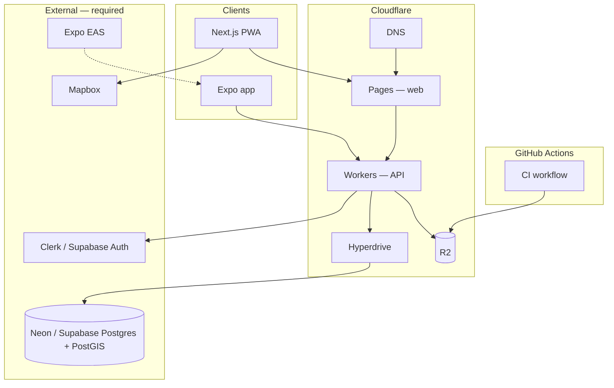

# Freshy

**Freshy** is a mobile-first cooling map — find air-conditioned refuges in hot cities.

## Repository structure

| Path              | Package          | Description                          |
| ----------------- | ---------------- | ------------------------------------ |
| `apps/web`        | `@freshy/web`    | Next.js PWA → **Cloudflare Pages**   |
| `apps/mobile`     | `@freshy/mobile` | Expo — Android & iOS (EAS)           |
| `packages/api`    | `@freshy/api`    | REST API + **Cloudflare R2**         |
| `packages/db`     | `@freshy/db`     | Prisma + PostgreSQL (Neon/Supabase) |
| `packages/ui`     | `@freshy/ui`     | Shared React components              |
| `packages/config` | `@freshy/config` | ESLint + Tailwind tokens             |

See [docs/setup-guide.md](docs/setup-guide.md) for click-by-click platform setup, [docs/architecture.md](docs/architecture.md), [docs/infrastructure.md](docs/infrastructure.md), [docs/roadmap.md](docs/roadmap.md), [docs/milestones/](docs/milestones/), and [CONTRIBUTING.md](CONTRIBUTING.md).

## Quick start

```bash
# Prerequisites: Node 20+, pnpm 9+, Docker (optional, for local DB)

bash scripts/setup-local-db.sh   # start PostGIS
pnpm install
pnpm db:generate
pnpm db:migrate
pnpm db:seed
pnpm dev                         # web :3000 + api :4000
```

## Scripts

| Command                          | Description                                      |
| -------------------------------- | ------------------------------------------------ |
| `bash scripts/validation.sh`     | Full validation (lint, test, build, screenshots) |
| `bash scripts/build.sh`          | Compile all packages                             |
| `bash scripts/setup-local-db.sh` | Local PostgreSQL via Docker                      |

## CI/CD

- **Pull requests** — lint, typecheck, tests, build, and **4-page screenshot preview** posted as a PR comment (hosted on **R2** when configured)
- **Releases** (`v*`) — Expo EAS builds for **Android** and **iOS**

Configure GitHub secrets: `R2_ACCOUNT_ID`, `R2_ACCESS_KEY_ID`, `R2_SECRET_ACCESS_KEY`, `R2_BUCKET_NAME`, `R2_PUBLIC_URL`, `EXPO_TOKEN`.  
See [infrastructure/cloudflare/README.md](infrastructure/cloudflare/README.md).

## Infrastructure

Cloudflare-first hosting with specialized providers where Cloudflare has no equivalent (PostGIS, maps, mobile stores).



| Provider | Services |
| -------- | -------- |
| **Cloudflare** | Pages (web), Workers (API), R2 (storage), Hyperdrive (DB pool), DNS, CDN |
| **Neon / Supabase** | PostgreSQL 16 + PostGIS |
| **Mapbox** | Map tiles & geocoding |
| **Expo EAS** | Mobile builds |
| **GitHub Actions** | CI pipeline |

Full split: [docs/infrastructure.md](docs/infrastructure.md).

## Design reference

Stitch export: [docs/stitch/](docs/stitch/)

## Contributing

[CONTRIBUTING.md](CONTRIBUTING.md) — development cycle, TDD workflow, and quality standards.

- [docs/development-cycle.md](docs/development-cycle.md) — step-by-step cycle (mandatory)
- [docs/quality-standards.md](docs/quality-standards.md) — rules and references per language
- [docs/setup-guide.md](docs/setup-guide.md) — **your setup checklist** (Cloudflare, Neon, Mapbox, R2)
- [docs/git-rules.md](docs/git-rules.md) — branching and PR checklist
