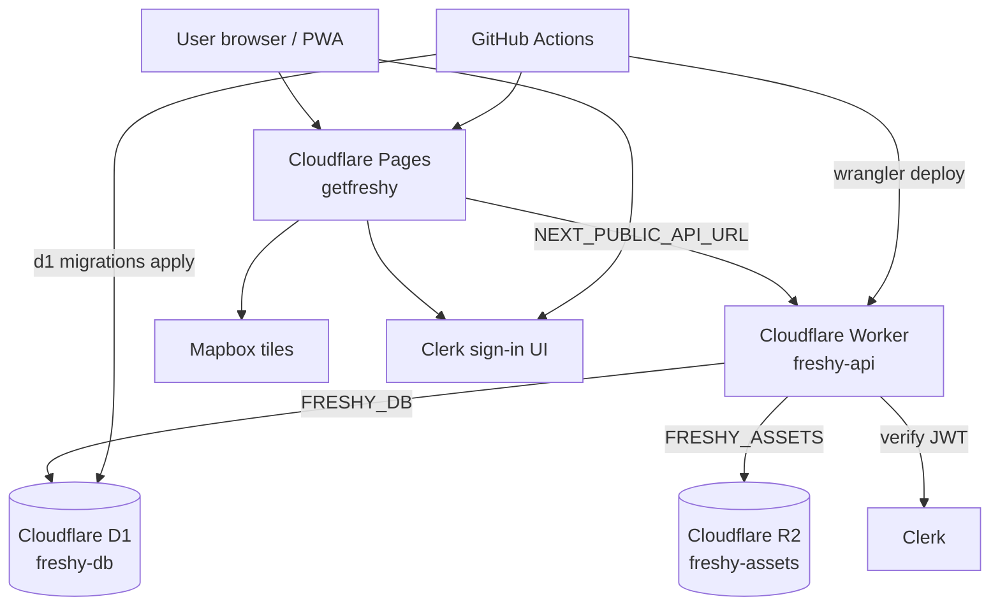
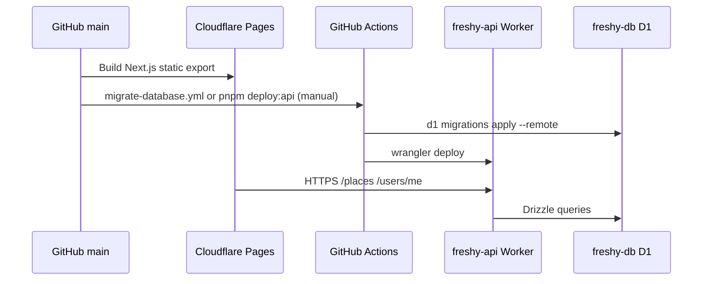
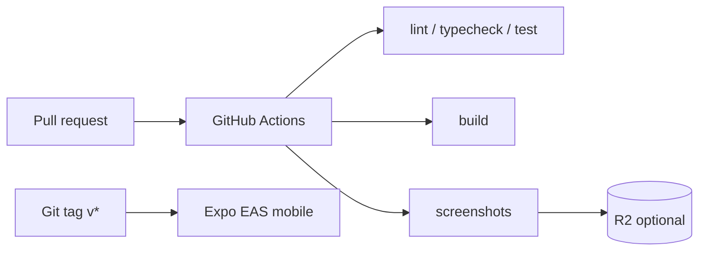

# Freshy

[](https://github.com/alexandrelheinen/freshy/actions/workflows/ci.yml)
[](https://github.com/alexandrelheinen/freshy/actions/workflows/smoke-production.yml)
[](https://github.com/alexandrelheinen/freshy/actions/workflows/production-screenshots.yml)
[](https://github.com/alexandrelheinen/freshy/actions/workflows/release.yml)
[](https://github.com/alexandrelheinen/freshy/actions/workflows/migrate-database.yml)
[](https://github.com/alexandrelheinen/freshy/actions/workflows/sync-place-defaults.yml)
[](https://getfreshy.pages.dev/explore)
[](https://freshy-api.alexandrelheinen.workers.dev/health)
[](https://dash.cloudflare.com/?to=/:account/workers/d1)

**Use the map:** https://getfreshy.pages.dev/explore  
**Android app (v0.4.0):** [Download APK](https://github.com/alexandrelheinen/freshy/releases/download/v0.4.0/freshy-v0.4.0-android.apk)

**Freshy** is a mobile-first cooling map: find air-conditioned refuges in hot cities.

| Surface                | URL                                             |
| ---------------------- | ----------------------------------------------- |
| **Live app**           | https://getfreshy.pages.dev/explore             |
| **Live API**           | https://freshy-api.alexandrelheinen.workers.dev |
| **Platform checklist** | [docs/platforms.md](docs/platforms.md)          |

---

## Production stack (June 2026)

Freshy runs on **Cloudflare** for web, API, database, and object storage. **Clerk** handles auth; **Mapbox** serves map tiles.

| Layer        | Provider          | Resource name   | Notes                       |
| ------------ | ----------------- | --------------- | --------------------------- |
| **Web**      | Cloudflare Pages  | `getfreshy`     | Next.js static export       |
| **API**      | Cloudflare Worker | `freshy-api`    | Hono on Workers             |
| **Database** | Cloudflare D1     | `freshy-db`     | SQLite, binding `FRESHY_DB` |
| **Storage**  | Cloudflare R2     | `freshy-assets` | Binding `FRESHY_ASSETS`     |
| **Auth**     | Clerk             | Freshy app      | JWT verified on Worker      |
| **Maps**     | Mapbox            | —               | Token on Pages              |
| **CI/CD**    | GitHub Actions    | `freshy` repo   | Lint, test, deploy          |

External services are limited to auth (Clerk), maps (Mapbox), and mobile builds (Expo EAS, future).

---

## Architecture



Deep dives: [docs/infrastructure.md](docs/infrastructure.md) · [docs/architecture.md](docs/architecture.md) · [docs/database.md](docs/database.md)

---

## Deploy pipeline

Pushing to `main` triggers **Cloudflare Pages** (web) and **GitHub Actions** (Worker + D1 migrations).



| Workflow                                                       | Trigger                      | Action                         |
| -------------------------------------------------------------- | ---------------------------- | ------------------------------ |
| Pages (Git integration)                                        | Push to `main`               | Build and deploy web shell     |
| [migrate-database.yml](.github/workflows/migrate-database.yml) | Manual (`workflow_dispatch`) | Remote D1 migrations only      |
| `pnpm deploy:api`                                              | Local / CI                   | Build and deploy Worker        |
| [ci.yml](.github/workflows/ci.yml)                             | Pull requests                | Lint, test, build, screenshots |

Required GitHub secrets: `CLOUDFLARE_API_TOKEN`, `CLOUDFLARE_ACCOUNT_ID`. See [docs/platforms.md](docs/platforms.md).

---

## Repository structure

| Path              | Package          | Deploy target                    |
| ----------------- | ---------------- | -------------------------------- |
| `apps/web`        | `@freshy/web`    | Cloudflare Pages                 |
| `apps/mobile`     | `@freshy/mobile` | Expo EAS (future)                |
| `packages/api`    | `@freshy/api`    | Cloudflare Worker (`freshy-api`) |
| `packages/db`     | `@freshy/db`     | Drizzle schema + D1 migrations   |
| `packages/ui`     | `@freshy/ui`     | Shared React components          |
| `packages/config` | `@freshy/config` | ESLint + Tailwind tokens         |
| `packages/theme`  | `@freshy/theme`  | YAML themes, CSS variables       |

Full layout: [docs/architecture.md](docs/architecture.md).

---

## Documentation index

| Doc                                                          | When to read it                                         |
| ------------------------------------------------------------ | ------------------------------------------------------- |
| **[docs/platforms.md](docs/platforms.md)**                   | **All platforms, resource names, env vars, dashboards** |
| [docs/local-development.md](docs/local-development.md)       | First-time setup, `wrangler dev`, local D1              |
| [docs/infrastructure.md](docs/infrastructure.md)             | Cloudflare services, bindings, R2 layout                |
| [docs/database.md](docs/database.md)                         | D1 schema, migrations, Drizzle                          |
| [docs/architecture.md](docs/architecture.md)                 | Monorepo layout, data flow, CI                          |
| [docs/mobile-publishing.md](docs/mobile-publishing.md)       | Android and iOS builds, stores, GitHub releases         |
| [docs/studio.md](docs/studio.md)                             | Admin Studio: Clerk role, moderation API                |
| [docs/place-classification.md](docs/place-classification.md) | Tags and freshness level catalogs                       |
| [docs/quality-standards.md](docs/quality-standards.md)       | Per-language quality rules                              |
| [docs/public-repo-hygiene.md](docs/public-repo-hygiene.md)   | Public-repo checklist after opening the GitHub repo     |
| [CONTRIBUTING.md](CONTRIBUTING.md)                           | TDD, PR rules, validation                               |

---

## Quick start (local)

```bash
# Prerequisites: Node 20+, pnpm 9+

pnpm install
pnpm --filter @freshy/db migrate:local   # local D1 via wrangler
pnpm dev                                 # web :3000 + Worker API via wrangler dev
```

Copy [`.env.example`](.env.example) → `.env` and add Mapbox + Clerk keys for full local auth.

| Service      | URL                                      |
| ------------ | ---------------------------------------- |
| Web          | http://localhost:3000                    |
| API (Worker) | http://localhost:8787 (wrangler default) |

Details: [docs/local-development.md](docs/local-development.md).

---

## Scripts

| Command                            | Description                                           |
| ---------------------------------- | ----------------------------------------------------- |
| `pnpm dev`                         | Web + API in parallel                                 |
| `pnpm build:api`                   | Build Worker bundle inputs (config, db, api)          |
| `pnpm smoke:api`                   | Build API and verify Worker `/health` locally         |
| `pnpm smoke:web`                   | Build web without prebuilt config dist (Pages parity) |
| `bash scripts/validation.sh`       | Full validation before PR                             |
| `bash scripts/smoke-production.sh` | Smoke test live Worker + Pages                        |

---

## CI/CD (pull requests)



Optional R2 secrets for PR screenshot comments: [infrastructure/cloudflare/README.md](infrastructure/cloudflare/README.md).

---

## Product status (June 2026)

| Version             | Status                                              |
| ------------------- | --------------------------------------------------- |
| **Public v0**       | Live: explore, cooling, place detail, map           |
| **Full v0 minimal** | Live: Clerk sign-in, saved places, profile from API |
| **Next**            | Climate reviews, relief points, custom domain       |

Pilot city: **Clichy, France** (92110).

---

## Design reference

Stitch export: [docs/stitch/freshy/DESIGN.md](docs/stitch/freshy/DESIGN.md)

---

## Contributing

[CONTRIBUTING.md](CONTRIBUTING.md) · [docs/quality-standards.md](docs/quality-standards.md) · [docs/git-rules.md](docs/git-rules.md)
