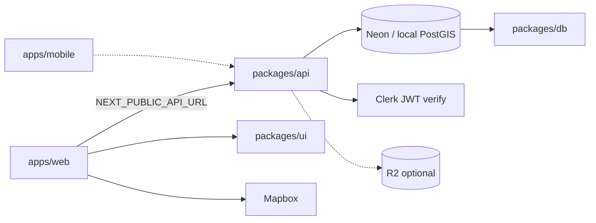

# Freshy | Architecture & Repository Layout

## Overview

Freshy is a **pnpm monorepo** managed with **Turborepo**. Each sub-project lives in its own folder with independent `package.json`, scripts, and CI integration.

**Hosting strategy:** Web on **Cloudflare Pages**; API on **Render** (interim); database on **Neon**; auth on **Clerk**. Target: Cloudflare Workers + Hyperdrive for API.

> **All platforms & dashboards:** [platforms.md](platforms.md)

```
freshy/
├── apps/
│   ├── web/                 # @freshy/web — Next.js PWA → Cloudflare Pages
│   └── mobile/              # @freshy/mobile — Expo (Android/iOS) → EAS
├── packages/
│   ├── api/                 # @freshy/api — Express → Render (prod); Workers later
│   ├── db/                  # @freshy/db — Prisma + PostgreSQL
│   ├── ui/                  # @freshy/ui — Shared React components
│   └── config/              # @freshy/config — ESLint + Tailwind preset
├── infrastructure/
│   ├── docker/              # Local PostGIS via Docker Compose
│   ├── cloudflare/          # R2, Pages, Workers wrangler template
│   └── render/              # Render blueprint (render.yaml)
├── scripts/
│   ├── validation.sh        # Full local validation pipeline
│   ├── build.sh             # Compile all packages
│   ├── setup-local-db.sh    # Start local PostgreSQL
│   └── post-pr-screenshots.sh
├── docs/
│   ├── stitch/              # Stitch design export (reference)
│   ├── database.md          # Schema, seed, migrations, env vars
│   ├── deploy-api.md        # Connect Pages → Render → Neon (production)
│   ├── platforms.md         # All platforms, env vars, checklists (START HERE)
│   ├── infrastructure.md    # Cloudflare vs external providers
│   ├── roadmap.md           # Product & phase plan
│   ├── architecture.md      # This file
│   ├── development-cycle.md # TDD workflow (mandatory)
│   ├── quality-standards.md # Per-language quality rules
│   ├── git-rules.md         # Branching & PR rules
│   └── milestones/          # Operational checklists per roadmap phase
│       ├── README.md        # Milestone index
│       └── phase-0-bootstrap.md
└── screenshots/             # CI-generated page previews (gitignored)
```

## Sub-projects mapped to roadmap phases

| Phase              | Folder(s)                                                    | Deliverable                           |
| ------------------ | ------------------------------------------------------------ | ------------------------------------- |
| 0 — Foundation     | `packages/config`, `packages/ui`, root tooling               | Design tokens, shared primitives      |
| 1 — Map            | `apps/web` `/explore`, `packages/db`                         | Geo places, map UI                    |
| 2 — Place detail   | `apps/web` `/places/[slug]`                                  | Detail page + API                     |
| 3 — Categories     | `apps/web` `/cooling`, `/cooling/[category]`, `/saved`       | Category browser + lists              |
| 4 — Auth & profile | `apps/web` `/profile`, `/profile/places/new`, `packages/api` | Clerk, saved places, user submissions |
| 5 — Reviews        | `packages/db` `Review`, `packages/api`                       | Climate review write, points          |
| 6 — PWA            | `apps/web`                                                   | Service worker, install prompt        |
| 7 — Launch         | `infrastructure/cloudflare`, CI/CD                           | R2 assets, production deploy          |
| Mobile             | `apps/mobile`                                                | Android + iOS via Expo EAS            |

## Data flow

**Production:** Pages → Render API → Neon. **Local:** web → Express → Docker PostGIS.



## Storage (Cloudflare R2)

All binary assets (place photos, avatars, CI screenshots) use **Cloudflare R2**. See [`infrastructure/cloudflare/README.md`](../infrastructure/cloudflare/README.md) and [`docs/infrastructure.md`](infrastructure.md).

## Local development

```bash
# 1. Start database
bash scripts/setup-local-db.sh

# 2. Install & migrate
pnpm install
pnpm db:generate
pnpm db:migrate
pnpm db:seed

# 3. Run everything
pnpm dev
```

| Service  | URL                   |
| -------- | --------------------- |
| Web      | http://localhost:3000 |
| API      | http://localhost:4000 |
| Postgres | localhost:5432        |

R2 is optional locally — set `R2_*` env vars to test uploads.

## CI/CD

| Workflow      | Trigger             | Actions                                                           |
| ------------- | ------------------- | ----------------------------------------------------------------- |
| `ci.yml`      | Pull request        | Lint, typecheck, test, build, 6-page screenshots → R2, PR comment |
| `release.yml` | GitHub Release `v*` | EAS build Android + iOS                                           |

## Scripts reference

| Script                      | Description                               |
| --------------------------- | ----------------------------------------- |
| `scripts/validation.sh`     | Full pipeline — use before opening a PR   |
| `scripts/build.sh`          | Compile all TypeScript / Next.js / API    |
| `scripts/setup-local-db.sh` | Docker PostGIS for simulators & local API |

Environment flags for `validation.sh`:

- `SKIP_DB=1` — skip Docker database
- `SKIP_SCREENSHOTS=1` — skip Playwright
- `SKIP_INSTALL=1` — skip `pnpm install`
