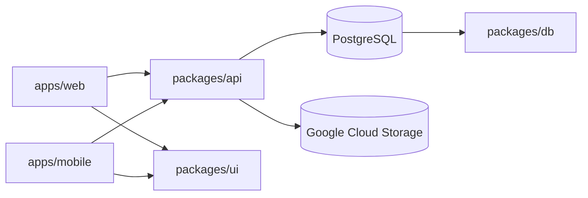

# Freshy — Architecture & Repository Layout

## Overview

Freshy is a **pnpm monorepo** managed with **Turborepo**. Each sub-project lives in its own folder with independent `package.json`, scripts, and CI integration.

```
freshy/
├── apps/
│   ├── web/                 # @freshy/web — Next.js PWA
│   └── mobile/              # @freshy/mobile — Expo (Android/iOS)
├── packages/
│   ├── api/                 # @freshy/api — Express REST + Google Cloud Storage
│   ├── db/                  # @freshy/db — Prisma + PostgreSQL
│   ├── ui/                  # @freshy/ui — Shared React components
│   └── config/              # @freshy/config — ESLint + Tailwind preset
├── infrastructure/
│   ├── docker/              # Local PostGIS via Docker Compose
│   └── gcp/                 # Google Cloud Storage setup guide
├── scripts/
│   ├── validation.sh        # Full local validation pipeline
│   ├── build.sh             # Compile all packages
│   ├── setup-local-db.sh    # Start local PostgreSQL
│   └── post-pr-screenshots.sh
├── docs/
│   ├── stitch/              # Stitch design export (reference)
│   ├── roadmap.md           # Product & phase plan
│   ├── architecture.md      # This file
│   ├── development-cycle.md # TDD workflow (mandatory)
│   ├── quality-standards.md # Per-language quality rules
│   └── git-rules.md         # Branching & PR rules
└── screenshots/             # CI-generated page previews (gitignored)
```

## Sub-projects mapped to roadmap phases

| Phase              | Folder(s)                                      | Deliverable                    |
| ------------------ | ---------------------------------------------- | ------------------------------ |
| 0 — Foundation     | `packages/config`, `packages/ui`, root tooling | Design tokens, shared shell    |
| 1 — Map            | `apps/web` `/explore`, `packages/db`           | Geo places, map UI             |
| 2 — Place detail   | `apps/web` `/places/[slug]`                    | Detail page + API              |
| 3 — Categories     | `apps/web` `/cooling`                          | Category browser               |
| 4 — Auth & profile | `apps/web` `/profile`, `packages/api`          | User accounts, saved places    |
| 5 — Reviews        | `packages/db` `Review`, `packages/api`         | Climate reviews, points        |
| 6 — PWA            | `apps/web`                                     | Service worker, install prompt |
| 7 — Launch         | `infrastructure/gcp`, CI/CD                    | GCS assets, production deploy  |
| Mobile             | `apps/mobile`                                  | Android + iOS via Expo EAS     |

## Data flow



## Storage (Google Cloud)

All binary assets (place photos, avatars, CI screenshots) use **Google Cloud Storage**. See [`infrastructure/gcp/README.md`](../infrastructure/gcp/README.md).

## Local development

```bash
# 1. Start database
bash scripts/setup-local-db.sh

# 2. Install & migrate
pnpm install
pnpm db:generate
pnpm db:migrate
pnpm db:seed

# 3. Run everything
pnpm dev
```

| Service  | URL                   |
| -------- | --------------------- |
| Web      | http://localhost:3000 |
| API      | http://localhost:4000 |
| Postgres | localhost:5432        |

## CI/CD

| Workflow      | Trigger             | Actions                                                      |
| ------------- | ------------------- | ------------------------------------------------------------ |
| `ci.yml`      | Pull request        | Lint, typecheck, test, build, 4-page screenshots, PR comment |
| `release.yml` | GitHub Release `v*` | EAS build Android + iOS                                      |

## Scripts reference

| Script                      | Description                               |
| --------------------------- | ----------------------------------------- |
| `scripts/validation.sh`     | Full pipeline — use before opening a PR   |
| `scripts/build.sh`          | Compile all TypeScript / Next.js / API    |
| `scripts/setup-local-db.sh` | Docker PostGIS for simulators & local API |

Environment flags for `validation.sh`:

- `SKIP_DB=1` — skip Docker database
- `SKIP_SCREENSHOTS=1` — skip Playwright
- `SKIP_INSTALL=1` — skip `pnpm install`
