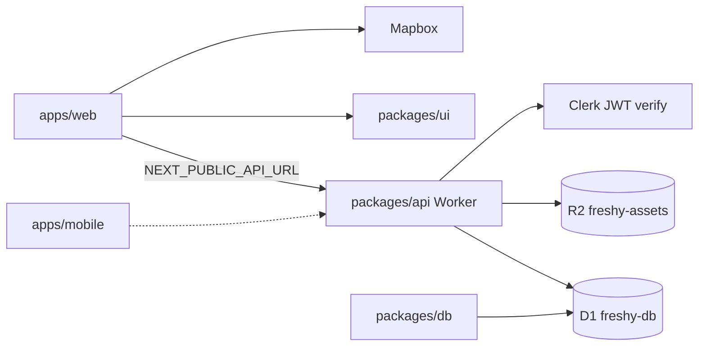

# Freshy | Architecture & Repository Layout

## Overview

Freshy is a **pnpm monorepo** managed with **Turborepo**. Each sub-project lives in its own folder with independent `package.json`, scripts, and CI integration.

**Hosting strategy:** Web, API, database, and storage on **Cloudflare** (Pages, Workers, D1, R2). Auth on **Clerk**; maps on **Mapbox**.

> **All platforms and dashboards:** [platforms.md](platforms.md)

```
freshy/
├── apps/
│   ├── web/                 # @freshy/web — Next.js PWA → Cloudflare Pages
│   └── mobile/              # @freshy/mobile — Expo (Android/iOS) → EAS
├── packages/
│   ├── api/                 # @freshy/api — Hono Worker → freshy-api
│   ├── db/                  # @freshy/db — Drizzle schema + D1 migrations
│   ├── ui/                  # @freshy/ui — Shared React components
│   ├── config/              # @freshy/config — ESLint + Tailwind preset
│   └── theme/               # @freshy/theme — YAML themes, CSS variables
├── infrastructure/
│   └── cloudflare/          # R2, Pages, Workers setup guide
├── scripts/
│   ├── validation.sh        # Full local validation pipeline
│   ├── build.sh             # Compile all packages
│   ├── smoke-api-start.sh   # Worker /health smoke test
│   └── post-pr-screenshots.sh
├── docs/
│   ├── stitch/              # Stitch design export (reference)
│   ├── platforms.md         # All platforms, env vars, checklists (START HERE)
│   ├── local-development.md # Local setup with wrangler dev
│   ├── infrastructure.md    # Cloudflare services and bindings
│   ├── database.md          # D1 schema, migrations, Drizzle
│   ├── studio.md            # Admin Studio: auth, API, moderation
│   ├── architecture.md      # This file
│   ├── quality-standards.md # Per-language quality rules
│   ├── place-classification.md
│   ├── git-rules.md         # Branching and PR rules
│   └── themes/              # Theme modularity + dark theme specs
└── screenshots/             # CI-generated page previews (gitignored)
```

---

## Data flow

**Production:** Pages → Worker → D1 + R2. **Local:** web → wrangler dev → local D1.



---

## Cloudflare bindings

Configured in [`packages/api/wrangler.toml`](../packages/api/wrangler.toml):

| Binding         | Resource           | Used by                    |
| --------------- | ------------------ | -------------------------- |
| `FRESHY_DB`     | D1 `freshy-db`     | Drizzle queries in Worker  |
| `FRESHY_ASSETS` | R2 `freshy-assets` | Photo uploads, asset reads |

---

## Local development

```bash
pnpm install
pnpm --filter @freshy/db migrate:local
pnpm dev
```

| Service      | URL                   |
| ------------ | --------------------- |
| Web          | http://localhost:3000 |
| API (Worker) | http://localhost:8787 |

Full guide: [local-development.md](local-development.md).

---

## CI/CD

| Workflow               | Trigger                      | Actions                                        |
| ---------------------- | ---------------------------- | ---------------------------------------------- |
| `ci.yml`               | Pull request                 | Lint, typecheck, test, build, screenshots → R2 |
| `deploy-api.yml`       | Push to `main`               | Build, D1 migrate, Worker deploy               |
| `migrate-database.yml` | Manual (`workflow_dispatch`) | D1 migrate only (no Worker deploy)             |
| `release.yml`          | GitHub Release `v*`          | EAS build Android + iOS                        |

---

## Scripts reference

| Script                        | Description                             |
| ----------------------------- | --------------------------------------- |
| `scripts/validation.sh`       | Full pipeline — use before opening a PR |
| `scripts/build.sh`            | Compile all TypeScript / Next.js / API  |
| `scripts/smoke-api-start.sh`  | Build + wrangler dev + probe `/health`  |
| `scripts/smoke-production.sh` | Smoke test live Worker + Pages          |

Environment flags for `validation.sh`:

- `SKIP_DB=1` — skip local D1 migrations
- `SKIP_SCREENSHOTS=1` — skip Playwright
- `SKIP_INSTALL=1` — skip `pnpm install`

---

## Package responsibilities

| Package          | Role                                           |
| ---------------- | ---------------------------------------------- |
| `@freshy/web`    | Next.js PWA, static export for Pages           |
| `@freshy/api`    | Hono routes, Clerk auth, R2 storage, D1 access |
| `@freshy/db`     | Drizzle schema, D1 migrations, geo helpers     |
| `@freshy/ui`     | Shared React components, route tokens          |
| `@freshy/config` | Place tags, freshness levels, ESLint/Tailwind  |
| `@freshy/theme`  | YAML theme compiler, CSS variables             |

---

## Related docs

| Doc                                    | Contents                             |
| -------------------------------------- | ------------------------------------ |
| [platforms.md](platforms.md)           | Resource names, env vars, dashboards |
| [infrastructure.md](infrastructure.md) | Cloudflare services in detail        |
| [database.md](database.md)             | Schema, migrations                   |
| [CONTRIBUTING.md](../CONTRIBUTING.md)  | TDD, PR rules                        |
