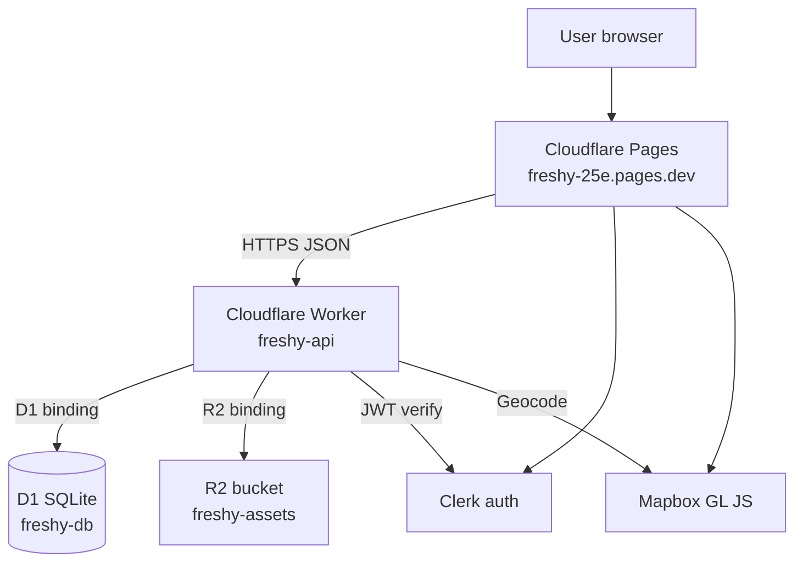

# Freshy | Cloudflare migration spec (Path B)

> **Goal:** Replace **Render** (API host) and **Neon** (PostgreSQL) with Cloudflare **Workers**, **D1**, and **R2**. The web shell stays on **Cloudflare Pages**. **Clerk** remains the auth provider.

After this migration, Freshy production runs entirely on Cloudflare for compute, database, storage, and static hosting. Render and Neon can be deleted once the checklist in [cloudflare-tutorial.md](cloudflare-tutorial.md) is complete.

---

## Target architecture



| Layer          | Before                    | After                        |
| -------------- | ------------------------- | ---------------------------- |
| Web app        | Cloudflare Pages          | Cloudflare Pages (unchanged) |
| API            | Render Express + Node     | Cloudflare Worker (Hono)     |
| Database       | Neon PostgreSQL + PostGIS | Cloudflare D1 (SQLite)       |
| Object storage | R2 via S3 API keys        | R2 via Worker binding        |
| Auth           | Clerk                     | Clerk (unchanged)            |
| Maps           | Mapbox                    | Mapbox (unchanged)           |

**Confirm:** Path B removes **Render** and **Neon** from production. No Hyperdrive, no external Postgres connection string.

---

## Cloudflare resource names

Values come from [`packages/api/wrangler.toml`](../packages/api/wrangler.toml) and the Cloudflare dashboard.

| Resource      | Wrangler / dashboard name | Worker binding  | Notes                   |
| ------------- | ------------------------- | --------------- | ----------------------- |
| Worker        | `freshy-api`              | n/a             | Entry: `src/worker.ts`  |
| D1 database   | `freshy-db`               | `FRESHY_DB`     | SQLite at the edge      |
| R2 bucket     | `freshy-assets`           | `FRESHY_ASSETS` | Place photos, CI assets |
| Pages project | `freshy-25e`              | n/a             | Static Next.js export   |

Production Worker route (today): `freshy-api.alexandrelheinen.workers.dev`. Custom domain `api.freshy.app` can replace it when DNS is ready.

---

## Code changes

### 1. API runtime: Express to Hono on Workers

Express depends on Node `http`/`net`, which Workers do not provide. The API entry point is a Hono app exported from `packages/api/src/worker.ts`.

| Concern           | Express (removed)         | Worker (new)                         |
| ----------------- | ------------------------- | ------------------------------------ |
| HTTP server       | `app.listen()`            | `export default app` (fetch handler) |
| Middleware        | `cors`, `express.json()`  | `hono/cors`, Hono body parsers       |
| Auth              | Custom Express middleware | Hono `requireAuth` / `requireAdmin`  |
| Multipart uploads | `multer`                  | `request.formData()`                 |
| Local dev         | `tsx watch src/server.ts` | `wrangler dev`                       |

Route handlers live in `user-routes.ts`, `studio-routes.ts`, and `app.ts`. Business logic stays in `places.ts`, `users.ts`, `create-place.ts`, and `studio-places.ts`.

### 2. Database: Prisma + PostgreSQL to Drizzle + D1

| Concern       | Before (Neon)                | After (D1)                                         |
| ------------- | ---------------------------- | -------------------------------------------------- |
| ORM           | Prisma                       | Drizzle ORM                                        |
| Dialect       | PostgreSQL                   | SQLite                                             |
| Connection    | `DATABASE_URL` env var       | `env.FRESHY_DB` binding                            |
| Migrations    | `prisma migrate deploy`      | `wrangler d1 migrations apply`                     |
| Geo queries   | PostGIS (`ST_DWithin`, etc.) | Haversine in TypeScript (`packages/db/src/geo.ts`) |
| Array columns | `String[]`                   | JSON text (`tags TEXT DEFAULT '[]'`)               |

Schema: [`packages/db/src/schema.ts`](../packages/db/src/schema.ts).  
Initial SQL: [`packages/db/migrations/0001_init.sql`](../packages/db/migrations/0001_init.sql).

Factory:

```typescript
import { createDb } from '@freshy/db';

const db = createDb(env.FRESHY_DB);
```

Prisma files under `packages/db/prisma/` remain for reference and seed scripts until Neon is fully decommissioned. They are not used by the Worker.

### 3. Object storage: R2 Worker binding

Uploads use the native R2 binding instead of the AWS S3 SDK and API tokens inside the Worker.

| Concern     | Render path                    | Worker path                                 |
| ----------- | ------------------------------ | ------------------------------------------- |
| Access      | `R2_ACCESS_KEY_ID` + S3 client | `env.FRESHY_ASSETS.put()`                   |
| Public URLs | `R2_PUBLIC_URL` var            | Same `R2_PUBLIC_URL` var in `wrangler.toml` |

### 4. Environment variables and secrets

Set in the Cloudflare Worker dashboard (Settings → Variables and Secrets) or via Wrangler secrets.

| Name                       | Type          | Purpose                                    |
| -------------------------- | ------------- | ------------------------------------------ |
| `CLERK_SECRET_KEY`         | Secret        | JWT verification                           |
| `CLERK_AUTHORIZED_PARTIES` | Secret or var | Allowed JWT audiences                      |
| `MAPBOX_ACCESS_TOKEN`      | Secret        | Forward geocoding                          |
| `R2_PUBLIC_URL`            | Var           | Public asset base URL (in `wrangler.toml`) |

No `DATABASE_URL` or `DIRECT_DATABASE_URL` on the Worker.

### 5. Web app (Pages)

Update Cloudflare Pages environment:

| Variable              | Value                                                                                           |
| --------------------- | ----------------------------------------------------------------------------------------------- |
| `NEXT_PUBLIC_API_URL` | Worker URL (e.g. `https://freshy-api.alexandrelheinen.workers.dev` or `https://api.freshy.app`) |

Pages build and deploy flow is unchanged.

### 6. CI/CD

Replace Render deploy hooks and `prisma migrate deploy` with Wrangler actions:

```yaml
- name: Deploy Worker
  uses: cloudflare/wrangler-action@v3
  with:
    apiToken: ${{ secrets.CLOUDFLARE_API_TOKEN }}
    accountId: ${{ secrets.CLOUDFLARE_ACCOUNT_ID }}
    workingDirectory: packages/api
    command: deploy

- name: Apply D1 migrations
  uses: cloudflare/wrangler-action@v3
  with:
    apiToken: ${{ secrets.CLOUDFLARE_API_TOKEN }}
    accountId: ${{ secrets.CLOUDFLARE_ACCOUNT_ID }}
    command: d1 migrations apply freshy-db --remote
```

GitHub secrets to add: `CLOUDFLARE_API_TOKEN`, `CLOUDFLARE_ACCOUNT_ID`.  
Secrets to remove after cutover: `DATABASE_URL`, `DIRECT_DATABASE_URL`, Render deploy hooks.

---

## PostGIS to Haversine

Neon used PostGIS for radius search. D1 has no PostGIS or SpatiaLite. Freshy replaces spatial SQL with:

- `latitude` / `longitude` `REAL` columns on `Place`
- `haversineDistanceKm()` and `filterPlacesByRadius()` in `packages/db/src/geo.ts`

This matches the pilot scale (single city, hundreds of places) and runs efficiently at the edge.

---

## Verification checklist

1. `wrangler dev` in `packages/api` returns `GET /health` with `db: ok`.
2. `wrangler d1 migrations apply freshy-db --remote` succeeds.
3. `GET /places?lat=48.9&lng=2.3` returns published places with distance.
4. Authenticated `POST /users/me/places` creates a D1 row.
5. Photo upload writes to R2 and returns a public URL.
6. Pages `NEXT_PUBLIC_API_URL` points at the Worker; explore map loads data.
7. Delete Render service and Neon project.

Step-by-step dashboard instructions: [cloudflare-tutorial.md](cloudflare-tutorial.md).

---

## Related docs

| Doc                                                                           | Purpose                        |
| ----------------------------------------------------------------------------- | ------------------------------ |
| [cloudflare-tutorial.md](cloudflare-tutorial.md)                              | Click-by-click migration guide |
| [platforms.md](platforms.md)                                                  | Live URLs and env var map      |
| [infrastructure/cloudflare/README.md](../infrastructure/cloudflare/README.md) | R2 and Pages setup             |
| [architecture.md](architecture.md)                                            | Monorepo layout                |
