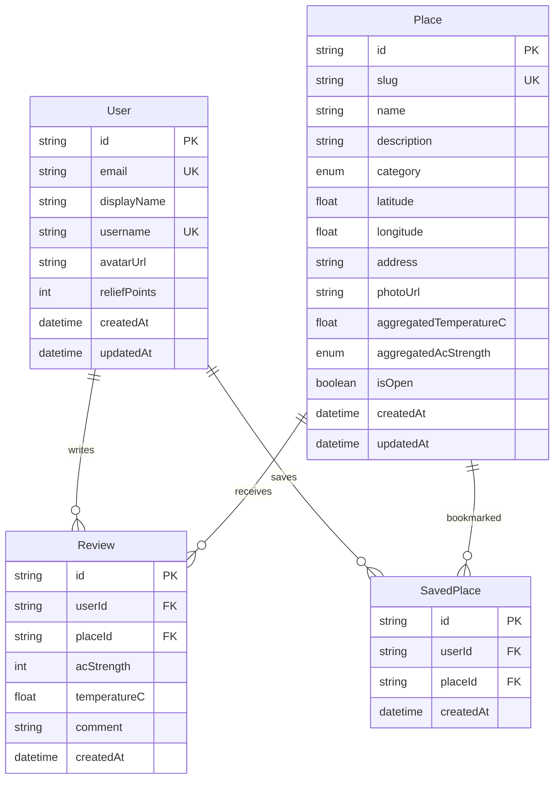

# Freshy | Database Design

> **Source of truth for structure:** [`packages/db/prisma/schema.prisma`](../packages/db/prisma/schema.prisma)  
> **All platforms:** [platforms.md](platforms.md)  
> **Setup (Neon, migrate, seed):** see the database sections in [`setup-guide.md`](setup-guide.md)  
> **Production API wiring:** [`deploy-api.md`](deploy-api.md)

---

## Overview

Freshy uses **PostgreSQL 16** with **PostGIS** (for future geo queries). The ORM is **Prisma 6**. Only the **API** (`packages/api`) and database tooling connect directly to Postgres. The web app and mobile app call the REST API over HTTP.

```
Browser / mobile  →  REST API  →  Prisma  →  PostgreSQL (Neon)
```

| Layer | Connects to DB? |
| ----- | --------------- |
| `apps/web` (Cloudflare Pages) | No — uses `NEXT_PUBLIC_API_URL` |
| `apps/mobile` (Expo) | No — uses API URL |
| `packages/api` (Express) | Yes — `DATABASE_URL` |
| `packages/db` (Prisma) | Yes — migrations, seed, client |

---

## Entity relationship



---

## Tables

### `User`

App users. One demo user is seeded for development.

| Column | Type | Notes |
| ------ | ---- | ----- |
| `id` | `TEXT` (cuid) | Primary key |
| `clerkId` | `TEXT` | Unique; Clerk user id (null for seed-only users) |
| `email` | `TEXT` | Unique |
| `displayName` | `TEXT` | Shown in UI |
| `username` | `TEXT` | Unique, e.g. `lucas_frescor` |
| `avatarUrl` | `TEXT` | Optional, R2 URL in production |
| `reliefPoints` | `INT` | Gamification score (default 0) |
| `createdAt` / `updatedAt` | `TIMESTAMP` | Audit |

### `Place`

Cooling venues on the map.

| Column | Type | Notes |
| ------ | ---- | ----- |
| `id` | `TEXT` (cuid) | Primary key |
| `slug` | `TEXT` | Unique URL slug, e.g. `ice-coffee-central` |
| `name` | `TEXT` | Display name |
| `description` | `TEXT` | Optional blurb |
| `category` | `PlaceCategory` | See enums below |
| `latitude` / `longitude` | `FLOAT` | WGS84 coordinates |
| `address` | `TEXT` | Optional street address |
| `photoUrl` | `TEXT` | Optional, R2 URL in production |
| `aggregatedTemperatureC` | `FLOAT` | Crowdsourced average (seed uses static values) |
| `aggregatedAcStrength` | `AcStrength` | Crowdsourced AC level |
| `isOpen` | `BOOLEAN` | Default `true` |

**Indexes:** `category`, `(latitude, longitude)`, unique `slug`.

### `Review`

User-submitted climate reviews for a place. Table exists; UI and write API ship in later phases.

| Column | Type | Notes |
| ------ | ---- | ----- |
| `userId` / `placeId` | `TEXT` | Foreign keys, cascade on delete |
| `acStrength` | `INT` | 1–3 scale at API layer |
| `temperatureC` | `FLOAT` | Optional felt temperature |
| `comment` | `TEXT` | Optional text |

### `SavedPlace`

User bookmarks (unique per user + place pair). Table exists; profile UI ships in Phase 4.

---

## Enums

### `PlaceCategory`

| Value | UI label (English) |
| ----- | ------------------ |
| `CAFE` | Café |
| `RESTAURANT` | Restaurant |
| `LIBRARY` | Library |
| `MALL` | Mall |
| `MUSEUM` | Museum |
| `COWORKING` | Coworking |
| `PUBLIC_SPACE` | Public space |

### `AcStrength`

| Value | Meaning |
| ----- | ------- |
| `LIGHTLY_COOLED` | Light AC |
| `COMFORTABLE` | Comfortable |
| `FRIGID` | Very cold |

---

## Pilot city & seed data

Seed script: [`packages/db/prisma/seed.ts`](../packages/db/prisma/seed.ts)  
Pilot config: [`packages/config/pilot-city.ts`](../packages/config/pilot-city.ts)

| Item | Value |
| ---- | ----- |
| City | **Clichy, France** (92110) |
| Center | `48.9042`, `2.3064` |
| Default search radius | 2 km |
| Seeded users | 1 — `lucas@freshy.app`, username `lucas_frescor` |
| Seeded places | 50 — all categories, spread around center |
| Seeded reviews | 0 |
| Seeded saved places | 0 |

Seed is **idempotent** (`upsert` by email / slug). Safe to re-run.

---

## Environment variables

| Variable | Where | Purpose |
| -------- | ----- | ------- |
| `DATABASE_URL` | API host, local `.env`, CI | Postgres connection string (Neon URI) |
| `NEXT_PUBLIC_API_URL` | Cloudflare Pages | Web → API base URL (**not** the database) |

See [`.env.example`](../.env.example). Never commit production credentials.

**Neon URLs:** use the **direct** connection string for migrations and seed; pooled (`-pooler`) is fine for the running API.

---

## Commands

Run from repository root unless noted.

| Task | Command |
| ---- | ------- |
| Generate Prisma client | `pnpm db:generate` |
| Create/apply migrations (local dev) | `pnpm db:migrate` |
| Apply migrations (production / Neon) | `DATABASE_URL="..." pnpm --filter @freshy/db migrate:deploy` |
| Seed demo data | `DATABASE_URL="..." pnpm db:seed` |
| Browse data (GUI) | `DATABASE_URL="..." pnpm --filter @freshy/db studio` |
| Enable PostGIS (Neon SQL Editor, once) | `CREATE EXTENSION IF NOT EXISTS postgis;` |

**Order for a fresh cloud database:** PostGIS → `db:generate` → `migrate:deploy` → `db:seed`.

---

## Migrations

| Migration | Description |
| --------- | ------------- |
| `20250629200000_init` | Creates enums, four tables, indexes, foreign keys |

Migration SQL: [`packages/db/prisma/migrations/20250629200000_init/migration.sql`](../packages/db/prisma/migrations/20250629200000_init/migration.sql)

---

## How the API uses the database

| Endpoint | DB usage |
| -------- | -------- |
| `GET /health` | No DB (optional R2 check) |
| `GET /places` | `Place.findMany` + radius filter in app code |
| `GET /places/meta/categories` | `Place.groupBy` + featured place |
| `GET /places/:slug` | `Place.findUnique` + reviews with user |

Geo filtering today uses **Haversine in application code** ([`packages/db/src/geo.ts`](../packages/db/src/geo.ts)). PostGIS is enabled for future `ST_DWithin` / GIST indexes.

---

## Hosting

| Environment | Database | API |
| ----------- | -------- | --- |
| Local | Docker PostGIS (`setup-local-db.sh`) | Express `:4000` |
| Production | **Neon** or Supabase | Express on Render (interim) → Cloudflare Workers + Hyperdrive (target) |

---

## Verification checklist

After setup, confirm:

```sql
SELECT COUNT(*) FROM "Place";   -- expect 50
SELECT COUNT(*) FROM "User";    -- expect 1
```

```bash
curl https://YOUR-API-URL/places        # JSON with data array
curl https://YOUR-API-URL/health        # {"status":"ok",...}
```

Deployed web app `/explore` shows places when `NEXT_PUBLIC_API_URL` points at that API.

---

_Last updated: June 2026_
