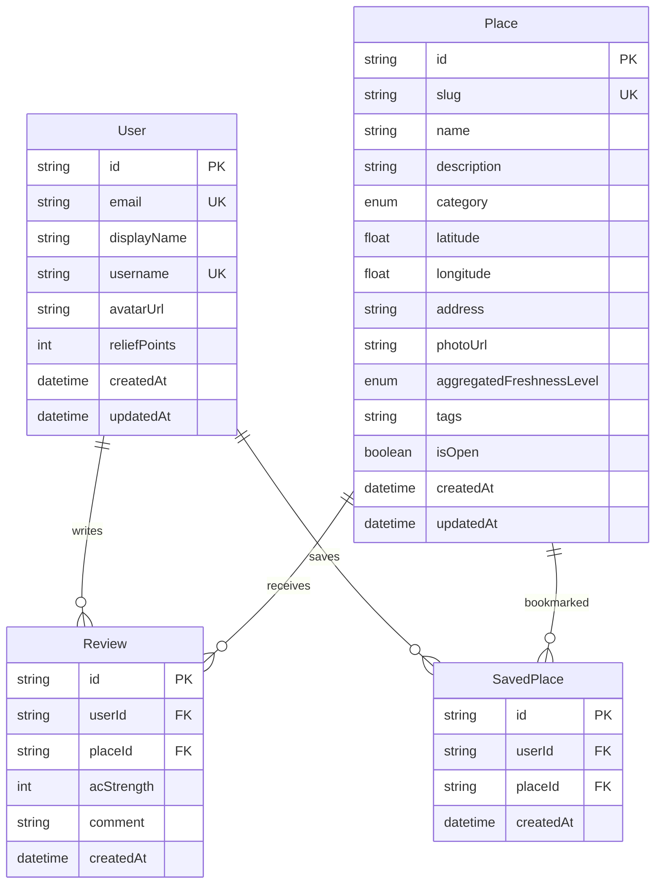

# Freshy | Database Design

> **Source of truth for structure:** [`packages/db/src/schema.ts`](../packages/db/src/schema.ts)  
> **All platforms:** [platforms.md](platforms.md)  
> **Local setup:** [local-development.md](local-development.md)

---

## Overview

Freshy uses **Cloudflare D1** (SQLite) in production and locally via wrangler. The ORM is **Drizzle**. Only the **API Worker** (`packages/api`) and database tooling connect directly to D1. The web app and mobile app call the REST API over HTTP.

```
Browser / mobile  →  REST API (Worker)  →  Drizzle  →  D1 (SQLite)
```

| Layer                         | Connects to DB?                 |
| ----------------------------- | ------------------------------- |
| `apps/web` (Cloudflare Pages) | No — uses `NEXT_PUBLIC_API_URL` |
| `apps/mobile` (Expo)          | No — uses API URL               |
| `packages/api` (Worker)       | Yes — `FRESHY_DB` binding       |
| `packages/db` (Drizzle)       | Yes — migrations, schema        |

---

## Entity relationship



---

## Tables

### `User`

App users. Production data is imported or created via Clerk sign-in.

| Column                    | Type          | Notes                          |
| ------------------------- | ------------- | ------------------------------ |
| `id`                      | `TEXT` (cuid) | Primary key                    |
| `clerkId`                 | `TEXT`        | Unique; Clerk user id          |
| `email`                   | `TEXT`        | Unique                         |
| `displayName`             | `TEXT`        | Shown in UI                    |
| `username`                | `TEXT`        | Unique                         |
| `avatarUrl`               | `TEXT`        | Optional, R2 URL               |
| `reliefPoints`            | `INTEGER`     | Gamification score (default 0) |
| `createdAt` / `updatedAt` | `DATETIME`    | Audit                          |

### `Place`

Cooling venues on the map.

| Column                     | Type          | Notes                                                                         |
| -------------------------- | ------------- | ----------------------------------------------------------------------------- |
| `id`                       | `TEXT` (cuid) | Primary key                                                                   |
| `slug`                     | `TEXT`        | Unique URL slug                                                               |
| `name`                     | `TEXT`        | Display name                                                                  |
| `description`              | `TEXT`        | Optional blurb                                                                |
| `category`                 | `TEXT`        | See enums below                                                               |
| `latitude` / `longitude`   | `REAL`        | WGS84 coordinates                                                             |
| `address`                  | `TEXT`        | Optional street address                                                       |
| `photoUrl`                 | `TEXT`        | Optional, R2 URL                                                              |
| `aggregatedFreshnessLevel` | `TEXT`        | Cooling quality tier (see [place-classification.md](place-classification.md)) |
| `tags`                     | `TEXT`        | JSON-encoded string array, e.g. `'["wifi","outdoor"]'`                        |
| `createdById`              | `TEXT`        | Optional FK to `User.id` of the contributor (see below)                       |
| `status`                   | `TEXT`        | `DRAFT` or `PUBLISHED` (public list shows `PUBLISHED` only)                   |
| `isOpen`                   | `BOOLEAN`     | Default `true`                                                                |

**Indexes:** `category`, `(latitude, longitude)`, `createdById`, unique `slug`.

### Contributor attribution (`createdById`)

Every user-submitted place stores the Freshy `User.id` of the contributor in `createdById`:

| Submission path                          | How `createdById` is set                        |
| ---------------------------------------- | ----------------------------------------------- |
| Signed in (`POST /users/me/places`)      | Authenticated user's `User.id`                  |
| Anonymous (`POST /contributions/places`) | `secret` field must match an existing `User.id` |

Legacy or admin-seeded places may have `createdById = null`. Studio moderation shows **Unknown** for those rows.

The anonymous **secret** is the contributor's `User.id` (UUID). Admins can look it up in Studio and share it offline with contributors who submit without signing in.

### `Review`

User-submitted climate reviews for a place.

| Column               | Type      | Notes                           |
| -------------------- | --------- | ------------------------------- |
| `userId` / `placeId` | `TEXT`    | Foreign keys, cascade on delete |
| `acStrength`         | `INTEGER` | 1–3 scale at API layer          |
| `comment`            | `TEXT`    | Optional text                   |

### `SavedPlace`

User bookmarks (unique per user + place pair).

---

## Enums

Stored as `TEXT` in SQLite. Defined in [`packages/db/src/schema.ts`](../packages/db/src/schema.ts).

### `PlaceCategory`

| Value          | UI label (English)                          |
| -------------- | ------------------------------------------- |
| `CAFE`         | Cafés & Bakeries                            |
| `RESTAURANT`   | Restaurants                                 |
| `BAR`          | Bars                                        |
| `LIBRARY`      | Libraries                                   |
| `MALL`         | Malls & Shops                               |
| `MUSEUM`       | Arts & Culture (UI; keyword stays `MUSEUM`) |
| `COWORKING`    | Coworking                                   |
| `PUBLIC_SPACE` | Public Spaces                               |

### `FreshnessLevel`

See [place-classification.md](place-classification.md) for full definitions.

| Value              | Meaning                             |
| ------------------ | ----------------------------------- |
| `NONE`             | No mechanical cooling               |
| `GOOD_VENTILATION` | Good ventilation, lowest blue tier  |
| `MODEST_AC`        | Modest pleasant air conditioning    |
| `VERY_COLD_AC`     | Very cold air conditioning          |
| `NATURALLY_FRESH`  | Naturally cool, green pinnacle tier |

### `PlaceStatus`

| Value       | Meaning                            |
| ----------- | ---------------------------------- |
| `DRAFT`     | Saved by user, not listed publicly |
| `PUBLISHED` | Visible on map and category lists  |

---

## Pilot city

Pilot config: [`packages/config/pilot-city.ts`](../packages/config/pilot-city.ts)

| Item                  | Value                      |
| --------------------- | -------------------------- |
| City                  | **Clichy, France** (92110) |
| Center                | `48.9042`, `2.3064`        |
| Default search radius | 2 km                       |

---

## Migrations

D1 migrations live in [`packages/db/migrations/`](../packages/db/migrations/). Applied via wrangler:

| Migration       | Description                                |
| --------------- | ------------------------------------------ |
| `0001_init.sql` | Creates four tables, indexes, foreign keys |

### Commands

Run from repository root:

| Task                           | Command                                                                         |
| ------------------------------ | ------------------------------------------------------------------------------- |
| Generate migration from schema | `pnpm --filter @freshy/db generate`                                             |
| Apply migrations (local D1)    | `pnpm --filter @freshy/db migrate:local`                                        |
| Apply migrations (remote D1)   | `pnpm --filter @freshy/db migrate:remote`                                       |
| Query via wrangler             | `wrangler d1 execute freshy-db --remote --command "SELECT COUNT(*) FROM Place"` |

Configuration: [`packages/api/wrangler.toml`](../packages/api/wrangler.toml) (D1 binding + `migrations_dir`).

---

## Geo queries

D1 has no PostGIS. Freshy uses **Haversine distance in application code** ([`packages/db/src/geo.ts`](../packages/db/src/geo.ts)) for radius search on `/places`.

---

## How the API uses the database

| Endpoint                               | DB usage                               |
| -------------------------------------- | -------------------------------------- |
| `GET /health`                          | Probes D1 with a lightweight query     |
| `GET /places`                          | Place list + radius filter in app code |
| `GET /places/meta/categories`          | Category aggregation                   |
| `GET /places/:slug`                    | Place detail + reviews with user       |
| `GET /users/me`                        | Profile with review and saved counts   |
| `GET /users/me/saved`                  | Saved places for current user          |
| `GET /users/me/reviews`                | Reviews authored by current user       |
| `POST /users/me/places`                | Create user-submitted place            |
| `POST/DELETE /users/me/saved/:placeId` | Bookmark toggle                        |

---

## Hosting

| Environment | Database                             | API                            |
| ----------- | ------------------------------------ | ------------------------------ |
| Local       | D1 via wrangler (`.wrangler/state/`) | wrangler dev                   |
| Production  | Cloudflare D1 `freshy-db`            | Cloudflare Worker `freshy-api` |

---

## Verification checklist

After setup, confirm:

```bash
curl -s https://freshy-api.alexandrelheinen.workers.dev/health | jq '.db'
# expect "ok"

curl -s "https://freshy-api.alexandrelheinen.workers.dev/places?lat=48.9042&lng=2.3064&radius=3" | jq '.data | length'
# expect > 0
```

Deployed web app `/explore` shows places when `NEXT_PUBLIC_API_URL` points at the Worker.

---

_Last updated: June 2026_
