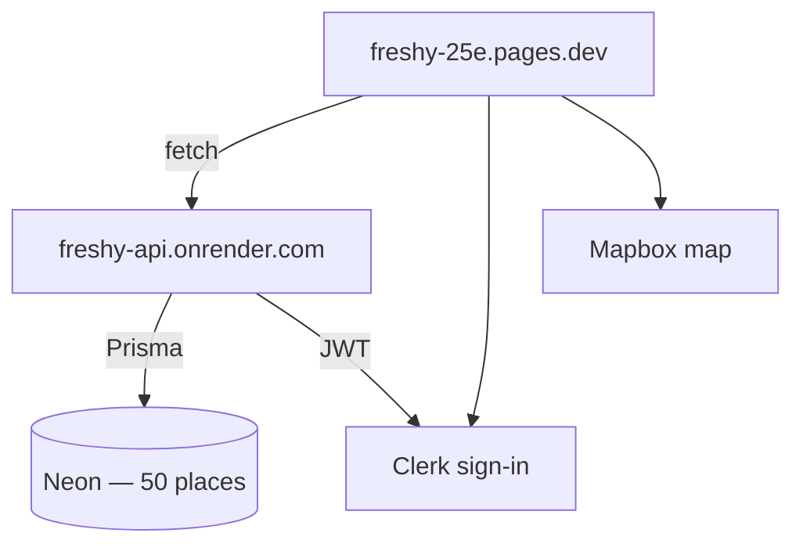

# Freshy — Deploy the API (connect web app to your database)

> **Master platform reference:** [platforms.md](platforms.md) — all dashboards, env vars, and checklists in one place.

> **Your situation:** The web app at `https://freshy-25e.pages.dev` loads from **Cloudflare Pages**. Data comes from **Render** + **Neon**. Auth uses **Clerk**.

---

## Why `api.freshy-25e.pages.dev` does not work

| What you have | What it is | Can it run `/places`? |
| ------------- | ---------- | --------------------- |
| `freshy-25e.pages.dev` | Cloudflare **Pages** — static Next.js site | No — it only serves HTML/JS |
| `api.freshy-25e.pages.dev` | Another **Pages** site (or empty project) | No — Pages is not a Node/Express server |

The Freshy API is an **Express + Prisma** program in `packages/api`. It must run on a **Node server** (Render, Railway, Fly.io, etc.) until we ship Cloudflare Workers.

**Cloudflare Pages ≠ API server.**  
**Neon database ≠ API server.**  
You need **both**: database (done) + API (this guide).

---

## Architecture (production)



---

## Step-by-step — deploy API on Render (free tier)

Render is the fastest way to get a public API URL. Alternatives: Railway, Fly.io (same idea: Node service + `DATABASE_URL`).

### Step 1 — Push your repo to GitHub

Render deploys from GitHub. Skip if the repo is already there.

### Step 2 — Create a Render account

1. Open [https://render.com](https://render.com)
2. Sign up with **GitHub**
3. Authorize Render to read your repositories

### Step 3 — Create a Web Service

1. Dashboard → **New +** → **Web Service**
2. Connect the **freshy** repository
3. Use these settings:

| Field | Value |
| ----- | ----- |
| **Name** | `freshy-api` |
| **Region** | Frankfurt or closest to Neon (`eu-west-2`) |
| **Branch** | `main` |
| **Root Directory** | *(leave empty — repo root)* |
| **Runtime** | **Node** |
| **Instance type** | Free |

4. **Build Command** — copy **only** the line below (do not include the word “Command” or any table header):

```
corepack enable && pnpm install && pnpm build:api
```

5. **Start Command** — copy **only** this line:

```
node packages/api/dist/server.js
```

Or click **Apply Blueprint** if you imported [`infrastructure/render/render.yaml`](../infrastructure/render/render.yaml).

### Step 4 — Add environment variables (after fixing build/start commands)

On the service → **Environment**:

| Key | Value |
| --- | ----- |
| `DATABASE_URL` | Your **Neon direct** connection URI (from Neon → Connect → URI). Use the **non-pooler** host for reliability on free tier. |
| `NODE_VERSION` | `20` |

Click **Save Changes**. Render will deploy (first build ~3–5 minutes).

### Step 5 — Copy your API URL

When deploy is green, Render shows a URL like:

```
https://freshy-api.onrender.com
```

### Step 6 — Test the API

Open in your browser:

```
https://freshy-api.onrender.com/health
```

Expected:

```json
{"status":"ok","service":"freshy-api","r2":"not-configured"}
```

Then:

```
https://freshy-api.onrender.com/places
```

Expected: JSON with `"data": [ ... 50 places ... ]`.

**If you see `503 Database unavailable`:** check `DATABASE_URL` on Render (typo, expired password, or Neon project paused — open Neon dashboard to wake it).

**Free tier cold start:** first request after idle may take ~30 seconds. Wait and refresh.

---

## Step-by-step — connect Cloudflare Pages to the API

### Step 7 — Set `NEXT_PUBLIC_API_URL` on Pages

1. [Cloudflare dashboard](https://dash.cloudflare.com) → **Workers & Pages**
2. Open project **freshy-25e** (your web app, not “api”)
3. **Settings** → **Environment variables**
4. Add or edit:

| Variable | Value | Environments |
| -------- | ----- | ------------ |
| `NEXT_PUBLIC_API_URL` | `https://freshy-api.onrender.com` | **Production** and **Preview** |
| `NODE_VERSION` | `20` | Production + Preview |

Use your **actual Render URL** — no trailing slash.

5. **Save**

### Step 8 — Redeploy the web app

Env vars apply only after a new build.

1. Same project → **Deployments**
2. Latest deployment → **⋯** menu → **Retry deployment**  
   Or push any commit to `main`.

Wait for build ✓.

### Step 9 — Verify the live site

1. Open [https://freshy-25e.pages.dev/explore](https://freshy-25e.pages.dev/explore)
2. You should see **places on the map and in the list**
3. Try [https://freshy-25e.pages.dev/places/ice-coffee-central](https://freshy-25e.pages.dev/places/ice-coffee-central)

**Hard-refresh** if you still see empty: `Ctrl+Shift+R` (Windows/Linux) or `Cmd+Shift+R` (Mac).

---

## Optional — Mapbox token

The map needs a Mapbox token or the map area may stay blank even when places load in the list.

1. [Mapbox access tokens](https://account.mapbox.com/access-tokens/) → copy **Default public token** (`pk....`)
2. Cloudflare Pages → **Environment variables** → add `NEXT_PUBLIC_MAPBOX_TOKEN` = your token
3. Redeploy Pages

---

## What you can delete or ignore

| Item | Action |
| ---- | ------ |
| Cloudflare Pages project **`api.freshy-25e`** | Not needed — delete or ignore. The API does not live on Pages. |
| `NEXT_PUBLIC_API_URL` = `whatever` | Must be your real API URL (e.g. Render) |

---

## Troubleshooting

| Symptom | Cause | Fix |
| ------- | ----- | --- |
| `/explore` empty, no errors | Wrong or missing `NEXT_PUBLIC_API_URL` | Step 7–8 |
| Browser network tab shows failed fetch to `localhost:4000` | Env var not set at build time | Set on Pages, **redeploy** |
| `api.freshy-25e.pages.dev` → “nothing here” | Pages site, not API | Deploy API on Render (Step 3) |
| API `/places` returns `[]` | Empty DB or wrong `DATABASE_URL` on Render | Re-run seed; fix env on Render |
| API `/places` returns `503` | DB connection failed | Check Neon URL; wake Neon project |
| First API request very slow | Render free tier sleep | Normal; upgrade or use a keep-alive ping later |

---

## Local smoke test (optional)

Before deploying, confirm everything works on your machine:

```bash
cd freshy
pnpm db:generate
# Put Neon DATABASE_URL in .env at repo root, then:
pnpm --filter @freshy/api dev
```

In another terminal or browser:

- [http://localhost:4000/places](http://localhost:4000/places) → 50 places  
- [http://localhost:3000/explore](http://localhost:3000/explore) → map with data (with `NEXT_PUBLIC_API_URL=http://localhost:4000` in `.env`)

---

## Clerk auth (Full v0 — saved places & profile)

1. [dashboard.clerk.com](https://dashboard.clerk.com) → **Create application** → name `freshy`
2. **Configure** → **Email, Phone, Username** → enable **Google** (optional) + **Email**
3. **API Keys** → copy **Publishable key** and **Secret key**

### Cloudflare Pages (web)

| Variable | Value |
| -------- | ----- |
| `NEXT_PUBLIC_CLERK_PUBLISHABLE_KEY` | `pk_test_...` or `pk_live_...` |

Redeploy Pages after adding.

### Render (API)

| Variable | Value |
| -------- | ----- |
| `CLERK_SECRET_KEY` | `sk_test_...` or `sk_live_...` |
| `CLERK_AUTHORIZED_PARTIES` | `https://freshy-25e.pages.dev,http://localhost:3000` |

Redeploy API after adding.

### Neon (one-time migration)

After merging the Full v0 branch, apply the new migration:

```bash
DATABASE_URL="your-neon-uri" pnpm --filter @freshy/db migrate:deploy
```

### Verify auth

1. `https://freshy-api.onrender.com/health` → `"auth":"configured"`
2. Open `/profile` on the site → **Sign in**
3. Save a place on `/places/ice-coffee-central` → appears on profile

---

## Future — Cloudflare Workers + Hyperdrive

Production target is API on **Cloudflare Workers** with **Hyperdrive** → Neon. That replaces Render when implemented. Until then, Render (or similar) is the supported path.

See [`infrastructure/cloudflare/README.md`](../infrastructure/cloudflare/README.md) and [`database.md`](database.md).

---

_Last updated: June 2026_
