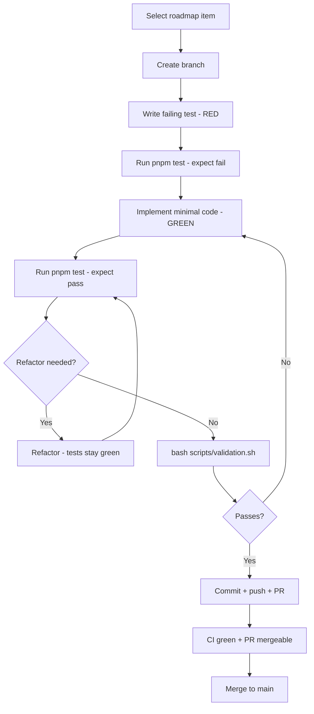

# Development Cycle | Freshy

This document defines the **mandatory step-by-step development cycle** for Freshy. **Test-driven development (TDD)** is the primary method for implementing behavior — not an optional add-on.

See [CONTRIBUTING.md](../CONTRIBUTING.md) for a quick summary, [quality-standards.md](quality-standards.md) for per-language rules, and the [Language](../CONTRIBUTING.md#language) policy (English-only docs and code).

---

## Philosophy

Freshy ships in **roadmap phases** ([roadmap.md](roadmap.md)). Each phase delivers demoable value. Within every phase, work is done in small increments using **Red → Green → Refactor**:

1. **Red** — Write a test that fails because the feature does not exist yet.
2. **Green** — Write the smallest amount of code to make the test pass.
3. **Refactor** — Improve structure without changing behavior; tests stay green.

If a change has no test, it is incomplete. Exceptions (pure config, docs-only) must be stated in the PR description.

---

## The development cycle (step-by-step)

Follow these steps **in order** for every change. Do not skip or reorder.

### Step 1 | Select work

- Open [docs/roadmap.md](roadmap.md) and find the **current phase**.
- Pick the **next unchecked item** in that phase (or a bug fix tied to existing scope).
- Confirm dependencies: e.g. Phase 1 requires Phase 0 foundation (monorepo, tokens, CI).

**Output:** A clear, single-scope task (one roadmap checkbox or one bug).

### Step 2 | Create a branch

```bash
git checkout main
git pull origin main
git checkout -b feat/<short-description>   # human contributors
# or
git checkout -b cursor/<feature>-e20f      # cloud agents
```

Branch naming rules: [git-rules.md](git-rules.md).

### Step 3 | Red (failing test)

Before production code:

1. Identify the **smallest testable unit** (function, component contract, route constant, API helper).
2. Add or extend a `*.test.ts` file using Node's `node:test` runner.
3. Run tests and **confirm failure**:

```bash
pnpm --filter @freshy/<package> test
# or
pnpm test
```

**Examples of good first tests:**

- Token map includes a new typography scale key from `DESIGN.md`
- Route helper returns the correct path for a place slug
- API utility returns `false` when required env vars are missing
- Prisma client exports expected model types

**Output:** A failing test that describes the desired behavior in code.

### Step 4 | Green (minimal implementation)

1. Implement only what is needed to pass the test.
2. Re-run tests until green:

```bash
pnpm test
```

3. For UI work, ensure pages expose `data-page="<name>"` for Playwright screenshot CI.

**Output:** All new and existing tests pass.

### Step 5 | Refactor

With green tests:

- Remove duplication; align naming with surrounding code.
- Move shared logic into `packages/ui`, `packages/api`, or `packages/db` as appropriate.
- Run format and lint:

```bash
pnpm format
pnpm lint
pnpm typecheck
```

**Output:** Cleaner code, same green tests.

### Step 6 | Validate locally

Run the full pipeline before committing:

```bash
bash scripts/validation.sh
```

Use skip flags only when necessary:

```bash
SKIP_DB=1 SKIP_SCREENSHOTS=1 bash scripts/validation.sh
```

**Output:** Local validation passes (or documented reason for skipped steps).

### Step 7 | Commit

- **One logical change per commit** (may be multiple commits per PR: e.g. test first, then implementation).
- Message format: imperative mood, English, concise.

```
Add typography tokens from design system

Port display-lg and body-lg scales into tailwind preset with unit tests.
```

**Output:** Focused git history.

### Step 8 | Open a pull request

1. Push branch: `git push -u origin <branch>`
2. Fill in the [PR template](../.github/pull_request_template.md)
3. Link the roadmap phase/item in the description
4. Wait for CI:
   - Format, lint, typecheck, test, build
   - Page screenshots (UI changes)
5. Confirm the PR is **mergeable** into current `main`:
   - `git fetch origin && git rebase origin/main` (resolve conflicts if any)
   - `git push --force-with-lease` after a rebase
   - On GitHub, the PR must not show merge or rebase conflicts

**Output:** PR with green CI, screenshot previews, and a mergeable branch.

### Step 9 | Review and merge

- Address review feedback; repeat Steps 3–6 for each fix.
- Ensure roadmap checkboxes are updated if the item is complete.
- Merge to `main` only after CI passes **and** the PR remains mergeable.

---

## TDD workflow diagram



---

## Test layers and when to use them

| Layer            | Location                           | Write when                                     |
| ---------------- | ---------------------------------- | ---------------------------------------------- |
| **Unit**         | `src/**/*.test.ts` in each package | Always, for logic and contracts                |
| **Integration**  | `packages/db`, `packages/api`      | DB queries, external service adapters          |
| **E2E / visual** | `apps/web/e2e/`                    | New pages, layout changes, `data-page` markers |

### Unit test template

```typescript
import { describe, it } from 'node:test';
import assert from 'node:assert/strict';

describe('feature name', () => {
  it('describes expected behavior', () => {
    assert.equal(actual, expected);
  });
});
```

Run in a package: `"test": "tsx --test src/**/*.test.ts"` (already configured).

### UI / page test contract

Every routable screen must:

1. Render without runtime errors
2. Include `data-page="<canonical-name>"` on the root element
3. Appear in `apps/web/e2e/screenshots.spec.ts` if it is one of the four main screens

---

## Aligning work with roadmap phases

| Phase              | TDD focus examples                                                 |
| ------------------ | ------------------------------------------------------------------ |
| **0 — Foundation** | Token tests, route constant tests, shell component smoke tests     |
| **1 — Map**        | Geo query helpers, `GET /places` handler tests, marker color logic |
| **2 — Detail**     | Slug resolution, `GET /places/:slug`, AC strength component        |
| **3 — Categories** | Category count aggregation, cooling tab list                       |
| **4 — Auth**       | Saved-places API, auth-guarded routes                              |
| **5 — Reviews**    | Review submission validation, score aggregation                    |
| **6 — PWA**        | Search debounce, service worker registration                       |
| **7 — Launch**     | Admin guards, upload pipeline, moderation                          |

When starting a phase, the **first commit** should often be a failing test that encodes the phase exit criteria.

---

## Commit series pattern (recommended)

For a single roadmap item, prefer this commit order:

| Commit | Contents                                                    |
| ------ | ----------------------------------------------------------- |
| 1      | `test: …` — failing tests only                              |
| 2      | `feat: …` — implementation; tests green                     |
| 3      | `docs: …` — roadmap checkbox, architecture note (if needed) |

This keeps review easy and proves TDD was followed.

---

## What not to do

| Anti-pattern                         | Why                                               |
| ------------------------------------ | ------------------------------------------------- |
| Implement first, test later          | Misses design feedback; often untested edge cases |
| Skip `validation.sh` before PR       | Wastes CI time; blocks merge                      |
| Mark task done with a conflicting PR | Branch cannot merge or rebase; blocks integration |
| Large PRs spanning multiple phases   | Hard to review; conflicts with roadmap ordering   |
| Ad-hoc colors/spacing outside tokens | Breaks design consistency                         |
| Commit secrets or `.env`             | Security incident                                 |

---

## Local development quick reference

```bash
# Start database
bash scripts/setup-local-db.sh

# Install and migrate
pnpm install
pnpm db:generate
pnpm db:migrate
pnpm db:seed

# Dev servers (web + api)
pnpm dev

# TDD loop
pnpm --filter @freshy/ui test -- --watch   # if watch needed, or re-run manually
pnpm test
bash scripts/validation.sh
```

---

## Related documents

- [CONTRIBUTING.md](../CONTRIBUTING.md) — entry point for contributors
- [quality-standards.md](quality-standards.md) — per-language rules and references
- [git-rules.md](git-rules.md) — branching and PR checklist
- [roadmap.md](roadmap.md) — what to build next
- [architecture.md](architecture.md) — where code lives

---

_Last updated: June 2026_
