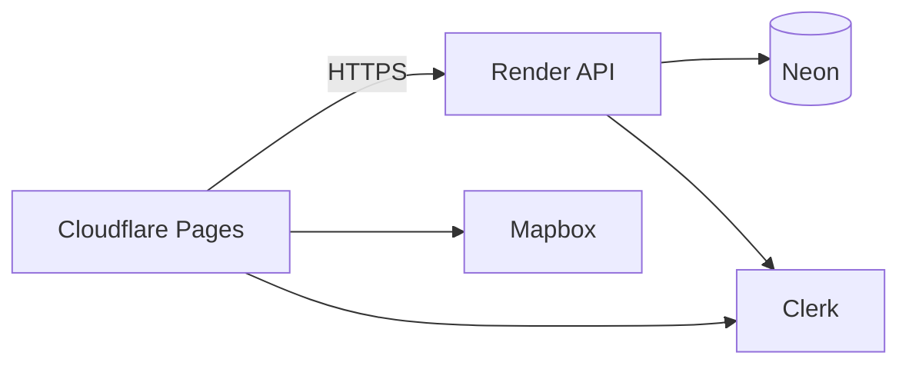
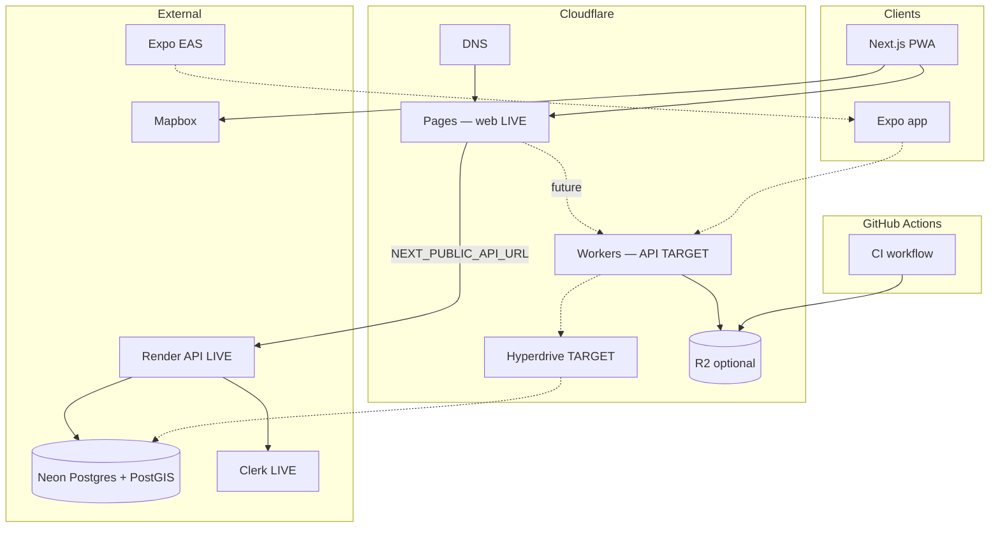
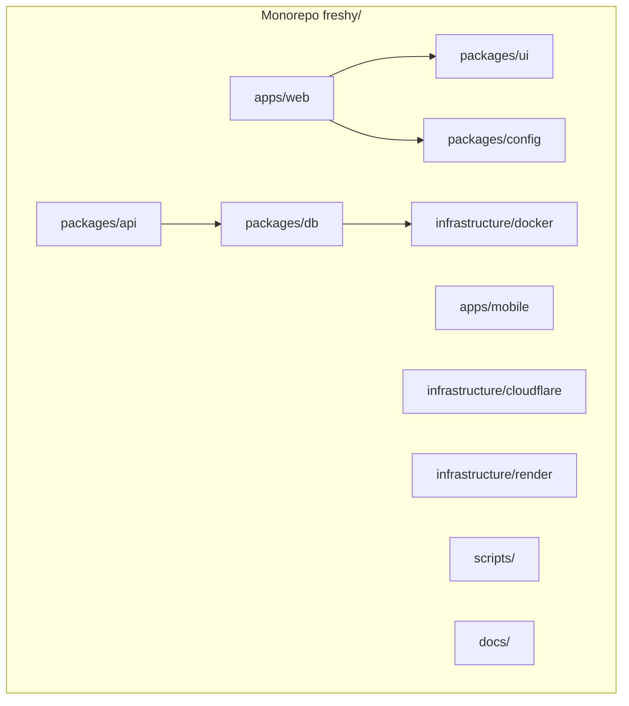

# Freshy | Infrastructure & Cloud Providers

Freshy uses **Cloudflare** for the web app (Pages), **Render** for the API (interim), **Neon** for Postgres, **Clerk** for auth, and **Mapbox** for maps. Cloudflare **Workers + Hyperdrive** are the target API host later.

> **Master platform checklist:** [docs/platforms.md](platforms.md)  
> **Deploy steps:** [docs/deploy-api.md](deploy-api.md)  
> **Local database:** [infrastructure/docker/docker-compose.yml](../infrastructure/docker/docker-compose.yml)

---

## Production today (June 2026)

| Service | Provider | URL |
| ------- | -------- | --- |
| Web | Cloudflare Pages | https://freshy-25e.pages.dev |
| API | Render | https://freshy-api.onrender.com |
| Database | Neon | PostGIS enabled |
| Auth | Clerk | JWT → Render API |
| Maps | Mapbox | Token on Pages |

---

## 1. What runs on Cloudflare

| Service | Cloudflare product | Freshy usage | Phase |
| ------- | ------------------ | ------------ | ----- |
| **Web app (PWA)** | **Pages** (+ OpenNext adapter) | Next.js SSR/RSC, PR previews, production | 0 |
| **REST API** | **Render** (today) → **Workers** (target) | Express on Render; Workers + Hyperdrive planned | 0–1 |
| **DB connection pooling** | **Hyperdrive** | Pool connections from Workers → external Postgres | 1+ |
| **Object storage** | **R2** | Place photos, avatars, CI screenshots, release mirrors | 0 |
| **CDN / edge cache** | **CDN** (built into Pages & R2) | Static assets, public images | 0 |
| **DNS** | **DNS** | `freshy.app`, R2 custom domains | 0 |
| **Image transforms** | **Images** (optional) | Thumbnails for place photos | 7 |
| **Background jobs** | **Queues** (optional) | Review score aggregation, notifications | 5+ |
| **Edge cache / config** | **KV** (optional) | Category counts, feature flags | 3+ |
| **Bot protection** | **Turnstile** (optional) | Review submission, place suggestions | 5+ |
| **Web analytics** | **Web Analytics** | Privacy-friendly page views (LGPD-friendly) | 7 |
| **Admin access** | **Access** (optional) | Protect `/admin` routes | 7 |
| **Email forwarding** | **Email Routing** (optional) | `hello@freshy.app` → inbox | 7 |

### R2 bucket layout

| Prefix | Content | Public read |
| ------ | ------- | ----------- |
| `places/` | Venue photos | Yes (via custom domain or `r2.dev`) |
| `avatars/` | User profile images | Yes |
| `ci/` | PR screenshot previews | Yes (for GitHub PR comments) |
| `releases/` | Mobile build mirrors (optional) | No |

---

## 2. What must stay elsewhere

Cloudflare **D1** is SQLite-only and does **not** support PostGIS. Map rendering and mobile store builds also require external vendors.

| Concern | Provider | Why not Cloudflare |
| ------- | -------- | ------------------ |
| **Primary database** | **Neon** or **Supabase** (PostgreSQL 16 + PostGIS) | PostGIS geo queries (`ST_DWithin`, GIST indexes) |
| **Maps & geocoding** | **Mapbox GL JS** | No first-party map tile / geocoding product |
| **Mobile builds** | **Expo EAS** | Apple App Store & Google Play toolchain |
| **CI pipeline** | **GitHub Actions** | Lint, test, build, screenshot upload to R2 |
| **End-user auth** | **Clerk** (live) | Sign-in, saved places, profile — `packages/api` verifies JWT |
| **Error monitoring** | **Sentry** (optional) | Full-stack error grouping & alerts |
| **Transactional email** | **Resend** or **SendGrid** (optional) | Welcome emails, review reminders |

### How services connect (target architecture)

Workers/Hyperdrive replace Render when the edge API ships. Diagram shows **target**; **today** the API box is **Render**.

---

## 3. Environment variables

See root [`.env.example`](../.env.example). Summary:

| Variable | Where set | Purpose |
| -------- | --------- | ------- |
| `DATABASE_URL` | Local `.env`, **Render**, Neon | Prisma → Postgres |
| `CLERK_SECRET_KEY` | **Render** | Verify Clerk JWT on API |
| `CLERK_AUTHORIZED_PARTIES` | **Render** | Allowed frontend origins |
| `NEXT_PUBLIC_CLERK_PUBLISHABLE_KEY` | **Cloudflare Pages** | Clerk in browser |
| `R2_*` | Local `.env`, GitHub Actions secrets | Object storage (optional) |
| `NEXT_PUBLIC_API_URL` | **Cloudflare Pages** | Web → Render API |
| `NEXT_PUBLIC_MAPBOX_TOKEN` | **Cloudflare Pages** | Map tiles |
| `EXPO_TOKEN` | GitHub Actions secrets | EAS mobile builds |

### GitHub Actions secrets (CI screenshots → R2)

| Secret | Description |
| ------ | ----------- |
| `R2_ACCOUNT_ID` | Cloudflare account ID |
| `R2_ACCESS_KEY_ID` | R2 API token access key |
| `R2_SECRET_ACCESS_KEY` | R2 API token secret |
| `R2_BUCKET_NAME` | e.g. `freshy-assets` |
| `R2_PUBLIC_URL` | Public base URL for objects (custom domain or `*.r2.dev`) |
| `EXPO_TOKEN` | Expo access token for mobile releases |

---

## 4. Repository layout (infrastructure)

See also [platforms.md](platforms.md) for what deploys where.

---

## 5. Deployment targets by phase

| Phase | Cloudflare | External |
| ----- | ---------- | -------- |
| **0 — Foundation** | Pages (web LIVE), R2 (optional CI) | Neon, Mapbox, **Render API**, **Clerk** |
| **1 — Map** | — | Mapbox GL JS, Render `/places` |
| **4 — Auth** | — | **Clerk LIVE**, saved places API |
| **5 — Reviews** | Queues (optional) | Review write API |
| **7 — Launch** | Workers + Hyperdrive (replace Render), Images, Turnstile | Sentry |

---

## 6. Local development (unchanged)

Cloudflare services are **optional locally**. Developers use:

- **Docker PostGIS** for the database (`bash scripts/setup-local-db.sh`)
- **Express API** on port 4000 (`pnpm dev`)
- **Next.js** on port 3000
- **R2** skipped unless `R2_*` env vars are set (same pattern as before with GCS)

---

## 7. Migration from Google Cloud

| Before (GCP) | After (Cloudflare) |
| ------------ | ------------------ |
| Google Cloud Storage | **R2** |
| `GCP_PROJECT_ID`, `GCS_BUCKET_NAME`, `GCP_SA_KEY` | `R2_ACCOUNT_ID`, `R2_*` keys |
| `gcloud storage cp` in CI | AWS CLI / SDK → R2 S3-compatible endpoint |
| Vercel (planned) | **Cloudflare Pages** |

Remove old GCP secrets from GitHub once R2 is configured.

---

## References

- [Cloudflare R2](https://developers.cloudflare.com/r2/)
- [Cloudflare Pages](https://developers.cloudflare.com/pages/)
- [Cloudflare Workers](https://developers.cloudflare.com/workers/)
- [Hyperdrive](https://developers.cloudflare.com/hyperdrive/)
- [OpenNext for Cloudflare](https://opennext.js.org/cloudflare)

_Last updated: June 2026_
