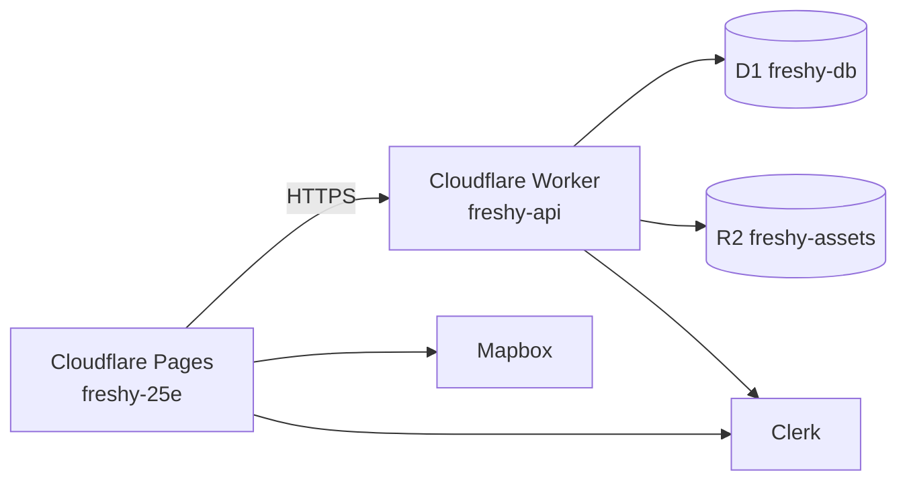
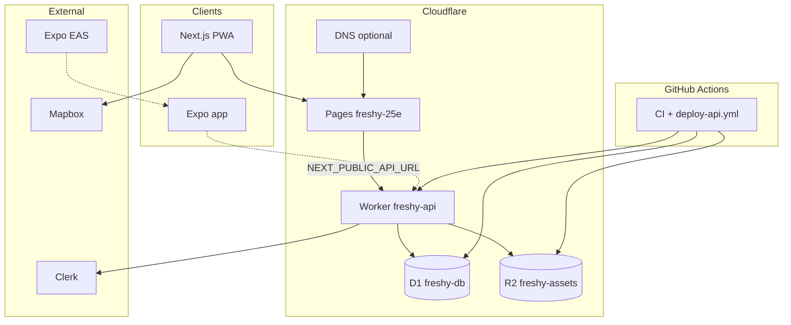

# Freshy | Infrastructure & Cloud Providers

Freshy production runs on **Cloudflare** for web (Pages), API (Workers), database (D1), and object storage (R2). **Clerk** handles auth; **Mapbox** serves maps.

> **Master platform checklist:** [docs/platforms.md](platforms.md)  
> **Local development:** [docs/local-development.md](local-development.md)

---

## Production today (June 2026)

| Service  | Provider          | Resource name   | URL                                             |
| -------- | ----------------- | --------------- | ----------------------------------------------- |
| Web      | Cloudflare Pages  | `freshy-25e`    | https://freshy-25e.pages.dev                    |
| API      | Cloudflare Worker | `freshy-api`    | https://freshy-api.alexandrelheinen.workers.dev |
| Database | Cloudflare D1     | `freshy-db`     | Binding `FRESHY_DB`                             |
| Storage  | Cloudflare R2     | `freshy-assets` | Binding `FRESHY_ASSETS`                         |
| Auth     | Clerk             | Freshy app      | JWT → Worker                                    |
| Maps     | Mapbox            | —               | Token on Pages                                  |



---

## Cloudflare services in use

| Service                 | Cloudflare product              | Freshy usage                                   | Config                  |
| ----------------------- | ------------------------------- | ---------------------------------------------- | ----------------------- |
| **Web app (PWA)**       | **Pages**                       | Next.js static export, PR previews, production | Git integration         |
| **REST API**            | **Workers**                     | Hono app in `packages/api`                     | `wrangler.toml`         |
| **Database**            | **D1**                          | SQLite, Drizzle ORM                            | `FRESHY_DB` binding     |
| **Object storage**      | **R2**                          | Place photos, avatars, CI screenshots          | `FRESHY_ASSETS` binding |
| **CDN / edge cache**    | **CDN** (built into Pages & R2) | Static assets, public images                   | Automatic               |
| **DNS**                 | **DNS** (optional)              | Custom domain `freshy.app`                     | Cloudflare DNS          |
| **Image transforms**    | **Images** (optional)           | Thumbnails for place photos                    | Future                  |
| **Background jobs**     | **Queues** (optional)           | Review score aggregation                       | Future                  |
| **Edge cache / config** | **KV** (optional)               | Category counts, feature flags                 | Future                  |
| **Bot protection**      | **Turnstile** (optional)        | Review submission, place suggestions           | Future                  |
| **Web analytics**       | **Web Analytics**               | Privacy-friendly page views                    | Future                  |
| **Admin access**        | **Access** (optional)           | Protect `/admin` routes                        | Future                  |

### R2 bucket layout

| Prefix             | Content                          | Public read                  |
| ------------------ | -------------------------------- | ---------------------------- |
| `places/`          | Venue photos                     | Yes (via `R2_PUBLIC_URL`)    |
| `places/defaults/` | Category default place photos    | Yes                          |
| `avatars/`         | User profile images              | Yes                          |
| `ci/`              | PR screenshot previews           | Yes (for GitHub PR comments) |
| `ci/main/latest/`  | Production page screenshots (CD) | Yes                          |
| `releases/`        | Mobile build mirrors (optional)  | No                           |

GitHub Actions on `main`: D1 migrations, R2 place defaults, production screenshots, and smoke tests. See [scripts/README.md](../scripts/README.md).

---

## External services

| Concern                 | Provider                              | Why external                                        |
| ----------------------- | ------------------------------------- | --------------------------------------------------- |
| **End-user auth**       | **Clerk**                             | Sign-in, saved places, profile; Worker verifies JWT |
| **Maps & geocoding**    | **Mapbox GL JS**                      | No first-party map tile product on Cloudflare       |
| **Mobile builds**       | **Expo EAS**                          | Apple App Store and Google Play toolchain           |
| **CI pipeline**         | **GitHub Actions**                    | Lint, test, build, deploy Worker, screenshot upload |
| **Error monitoring**    | **Sentry** (optional)                 | Full-stack error grouping and alerts                |
| **Transactional email** | **Resend** or **SendGrid** (optional) | Welcome emails, review reminders                    |

---

## How services connect



---

## Environment variables

See root [`.env.example`](../.env.example). Summary:

| Variable                            | Where set              | Purpose                          |
| ----------------------------------- | ---------------------- | -------------------------------- |
| `CLERK_SECRET_KEY`                  | Worker secret          | Verify Clerk JWT on API          |
| `CLERK_AUTHORIZED_PARTIES`          | Worker secret          | Allowed frontend origins         |
| `NEXT_PUBLIC_CLERK_PUBLISHABLE_KEY` | Cloudflare Pages       | Clerk in browser                 |
| `NEXT_PUBLIC_API_URL`               | Cloudflare Pages       | Web → Worker API                 |
| `NEXT_PUBLIC_MAPBOX_TOKEN`          | Cloudflare Pages       | Map tiles                        |
| `MAPBOX_ACCESS_TOKEN`               | Worker secret          | Server-side geocoding            |
| `R2_PUBLIC_URL`                     | `wrangler.toml` vars   | Public base URL for R2 objects   |
| `NEXT_PUBLIC_R2_PUBLIC_URL`         | Cloudflare Pages       | Default place photos in web app  |
| `R2_*`                              | GitHub Actions secrets | CI screenshot uploads (optional) |
| `CLOUDFLARE_API_TOKEN`              | GitHub Actions secrets | Worker deploy + D1 migrations    |
| `CLOUDFLARE_ACCOUNT_ID`             | GitHub Actions secrets | Wrangler account ID              |
| `EXPO_TOKEN`                        | GitHub Actions secrets | EAS mobile builds                |

Worker bindings (`FRESHY_DB`, `FRESHY_ASSETS`) are configured in [`packages/api/wrangler.toml`](../packages/api/wrangler.toml), not as env vars.

---

## Repository layout (infrastructure)

```
infrastructure/
└── cloudflare/
    ├── README.md              # R2, Pages, Worker setup guide
    └── wrangler.toml.example  # Template (production config is packages/api/wrangler.toml)
```

See [architecture.md](architecture.md) for the full monorepo layout.

---

## Local development

Cloudflare bindings are emulated locally via **wrangler dev**:

- **D1**: local SQLite under `.wrangler/state/` (apply with `pnpm --filter @freshy/db migrate:local`)
- **R2**: local bucket emulation in wrangler dev
- **API**: `pnpm --filter @freshy/api dev` (wrangler dev on port 8787)
- **Web**: Next.js on port 3000

Full guide: [local-development.md](local-development.md).

---

## References

- [Cloudflare Workers](https://developers.cloudflare.com/workers/)
- [Cloudflare D1](https://developers.cloudflare.com/d1/)
- [Cloudflare R2](https://developers.cloudflare.com/r2/)
- [Cloudflare Pages](https://developers.cloudflare.com/pages/)
- [Wrangler CLI](https://developers.cloudflare.com/workers/wrangler/)
- [Hono on Workers](https://hono.dev/docs/getting-started/cloudflare-workers)

_Last updated: June 2026_
