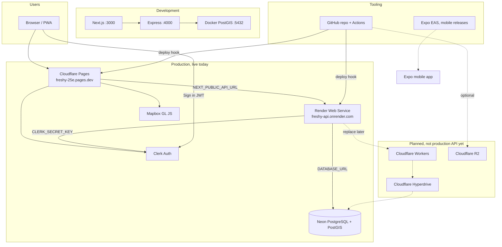
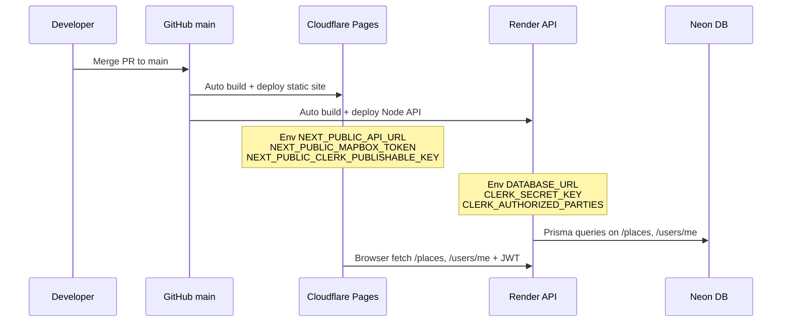
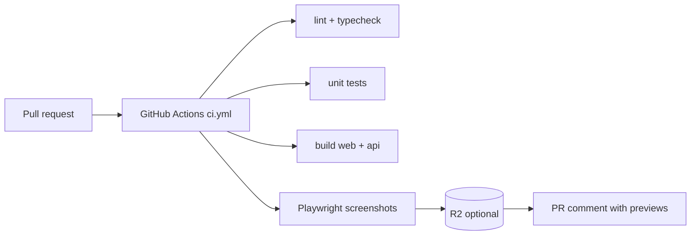

# Freshy | Platforms & services reference

> **Purpose:** Single checklist of every external platform Freshy uses, what it does, where to click, and which env vars belong where.  
> **Update this file** when you add or change a provider.

**Production (June 2026):**

| Layer       | Provider         | Live URL                                   |
| ----------- | ---------------- | ------------------------------------------ |
| Web app     | Cloudflare Pages | https://freshy-25e.pages.dev               |
| API         | Render           | https://freshy-api.onrender.com            |
| Database    | Neon             | _(connection string only, no public URL)_  |
| Auth        | Clerk            | https://dashboard.clerk.com                |
| Maps        | Mapbox           | _(token in Pages env)_                     |
| Source code | GitHub           | https://github.com/alexandrelheinen/freshy |

---

## Platform map



---

## 1. GitHub | source code & CI

| Item                      | Value                                                               |
| ------------------------- | ------------------------------------------------------------------- |
| **Dashboard**             | https://github.com/alexandrelheinen/freshy                          |
| **Role**                  | Git repo, pull requests, GitHub Actions CI, release tags for mobile |
| **Branch for production** | `main`                                                              |
| **What you do here**      | Push code, merge PRs, configure Actions secrets                     |

### GitHub Actions secrets (optional, PR screenshots + CD)

| Secret                 | Used for                                              |
| ---------------------- | ----------------------------------------------------- |
| `R2_ACCOUNT_ID`        | Upload CI screenshots to R2                           |
| `R2_ACCESS_KEY_ID`     | R2 API                                                |
| `R2_SECRET_ACCESS_KEY` | R2 API                                                |
| `R2_BUCKET_NAME`       | e.g. `freshy-assets`                                  |
| `R2_PUBLIC_URL`        | Public URL for screenshot links in PR comments        |
| `DATABASE_URL`         | Neon URI; automatic `prisma migrate deploy` on `main` |
| `EXPO_TOKEN`           | Mobile EAS builds on release                          |

**Docs:** [.github/workflows/ci.yml](../.github/workflows/ci.yml), [CD workflows](../.github/workflows/)

---

## 2. Cloudflare Pages | web app (frontend)

| Item             | Value                                                              |
| ---------------- | ------------------------------------------------------------------ |
| **Dashboard**    | https://dash.cloudflare.com → **Workers & Pages** → **freshy-25e** |
| **Live site**    | https://freshy-25e.pages.dev                                       |
| **Deploys from** | GitHub `main` (auto on push)                                       |
| **Build root**   | `apps/web` (monorepo build from repo root; see project settings)   |
| **Output**       | Static export (`out/`)                                             |

### Environment variables (Pages)

Set under **Settings → Environment variables** (Production **and** Preview):

| Variable                            | Example / notes                                          |
| ----------------------------------- | -------------------------------------------------------- |
| `NODE_VERSION`                      | `20`                                                     |
| `NEXT_PUBLIC_API_URL`               | `https://freshy-api.onrender.com`, **no trailing slash** |
| `NEXT_PUBLIC_MAPBOX_TOKEN`          | Mapbox public token (`pk....`)                           |
| `NEXT_PUBLIC_CLERK_PUBLISHABLE_KEY` | Clerk **Publishable key** (`pk_test_...`)                |

**After changing env vars → redeploy** (Deployments → Retry deployment).

**Docs:** [deploy-api.md](deploy-api.md), [infrastructure/cloudflare/README.md](../infrastructure/cloudflare/README.md)

---

## 3. Render | API (backend)

| Item             | Value                                                 |
| ---------------- | ----------------------------------------------------- |
| **Dashboard**    | https://dashboard.render.com → service **freshy-api** |
| **Live API**     | https://freshy-api.onrender.com                       |
| **Health check** | https://freshy-api.onrender.com/health                |
| **Deploys from** | GitHub `main`                                         |
| **Runtime**      | Node 20, Express (`packages/api`)                     |

### Build & start commands

| Field             | Value                                               |
| ----------------- | --------------------------------------------------- |
| **Build Command** | `corepack enable && pnpm install && pnpm build:api` |
| **Start Command** | `node packages/api/dist/server.js`                  |

Blueprint: [infrastructure/render/render.yaml](../infrastructure/render/render.yaml)

### Environment variables (Render)

| Variable                   | Purpose                                              |
| -------------------------- | ---------------------------------------------------- |
| `NODE_VERSION`             | `20`                                                 |
| `DATABASE_URL`             | Neon connection URI                                  |
| `CLERK_SECRET_KEY`         | Clerk **Secret key** (`sk_test_...`)                 |
| `CLERK_AUTHORIZED_PARTIES` | `https://freshy-25e.pages.dev,http://localhost:3000` |
| `PORT`                     | Set automatically by Render                          |

**Docs:** [deploy-api.md](deploy-api.md)

---

## 4. Neon | PostgreSQL database

| Item                | Value                                                  |
| ------------------- | ------------------------------------------------------ |
| **Dashboard**       | https://console.neon.tech                              |
| **Role**            | Production Postgres 16 + PostGIS, shared by Render API |
| **Pilot city data** | Clichy, France, 50 seeded places, 1 demo user          |

### What you do here

| Task                   | How                                                          |
| ---------------------- | ------------------------------------------------------------ |
| Copy connection string | Project → **Connect** → **URI**                              |
| Enable PostGIS (once)  | **SQL Editor** → `CREATE EXTENSION IF NOT EXISTS postgis;`   |
| Run migrations         | `DATABASE_URL="..." pnpm --filter @freshy/db migrate:deploy` |
| Seed demo data         | `DATABASE_URL="..." pnpm db:seed`                            |
| Verify data            | `SELECT COUNT(*) FROM "Place";` → expect **50**              |

**Docs:** [database.md](database.md), [deploy-api.md](deploy-api.md)

---

## 5. Clerk | authentication

| Item            | Value                                        |
| --------------- | -------------------------------------------- |
| **Dashboard**   | https://dashboard.clerk.com                  |
| **Application** | **Freshy**                                   |
| **Role**        | Sign-in, JWT sessions, user profile metadata |

### Keys (Configure → API keys)

| Key                 | Starts with   | Goes on                                                |
| ------------------- | ------------- | ------------------------------------------------------ |
| **Publishable key** | `pk_test_...` | Cloudflare Pages → `NEXT_PUBLIC_CLERK_PUBLISHABLE_KEY` |
| **Secret key**      | `sk_test_...` | Render → `CLERK_SECRET_KEY`                            |

Copy from **Quick copy** (Next.js block) or the **Publishable key** row — not “Public key (Never used)”.

### Verify auth

1. https://freshy-api.onrender.com/health → `"auth":"configured"`
2. https://freshy-25e.pages.dev/profile → Sign in works
3. Save a place → appears on profile

**Docs:** [deploy-api.md#clerk-auth-full-v0--saved-places--profile](deploy-api.md)

---

## 6. Mapbox | map tiles

| Item          | Value                                     |
| ------------- | ----------------------------------------- |
| **Dashboard** | https://account.mapbox.com                |
| **Tokens**    | https://account.mapbox.com/access-tokens/ |
| **Role**      | Map on `/explore`                         |

| Variable                   | Where                                    |
| -------------------------- | ---------------------------------------- |
| `NEXT_PUBLIC_MAPBOX_TOKEN` | Cloudflare Pages (public token `pk....`) |

Local: same variable in root `.env`.

---

## 7. Docker | local database only

| Item            | Value                                                                                   |
| --------------- | --------------------------------------------------------------------------------------- |
| **Config**      | [infrastructure/docker/docker-compose.yml](../infrastructure/docker/docker-compose.yml) |
| **Image**       | `postgis/postgis:16-3.4`                                                                |
| **Port**        | `localhost:5432`                                                                        |
| **Credentials** | user `freshy`, password `freshy_dev`, db `freshy`                                       |

```bash
bash scripts/setup-local-db.sh
```

Not used in production; production uses **Neon**.

---

## 8. Cloudflare R2 | object storage (optional)

| Item          | Value                                                          |
| ------------- | -------------------------------------------------------------- |
| **Dashboard** | https://dash.cloudflare.com → **R2**                           |
| **Role**      | Place photos, avatars, **CI PR screenshots** (when configured) |
| **Status**    | Optional; API reports `"r2":"not-configured"` until set        |

**Docs:** [infrastructure/cloudflare/README.md](../infrastructure/cloudflare/README.md)

---

## 9. Expo EAS | mobile builds (future)

| Item          | Value                                               |
| ------------- | --------------------------------------------------- |
| **Dashboard** | https://expo.dev                                    |
| **Role**      | Android/iOS builds triggered by GitHub Release tags |
| **Status**    | Scaffold in `apps/mobile`; not required for web v0  |

---

## 10. Planned migrations (not production yet)

| Service                   | Replaces                     | When                                |
| ------------------------- | ---------------------------- | ----------------------------------- |
| **Cloudflare Workers**    | Render API                   | Target production API host          |
| **Cloudflare Hyperdrive** | Direct Neon URL from Workers | Connection pooling at edge          |
| **Custom domain**         | `*.pages.dev`                | e.g. `freshy.app` on Cloudflare DNS |

Template: [infrastructure/cloudflare/wrangler.toml.example](../infrastructure/cloudflare/wrangler.toml.example)

---

## Deploy pipeline (production)



---

## CI pipeline (pull requests)



---

## Master checklist | new environment or disaster recovery

Use this when onboarding or rebuilding from scratch:

- [ ] **GitHub**: repo cloned, `pnpm install` works locally
- [ ] **Neon**: project created, PostGIS enabled, migrate + seed (50 places)
- [ ] **Render**: `freshy-api` service, build/start commands, `DATABASE_URL` + Clerk env
- [ ] **Cloudflare Pages**: `freshy-25e`, API URL + Mapbox + Clerk publishable key
- [ ] **Clerk**: Freshy app, keys copied to Render + Pages
- [ ] **Mapbox**: public token on Pages
- [ ] **Verify**: `/health` auth configured, `/explore` shows map, `/profile` sign-in, save place works
- [ ] **(Optional) R2 + GitHub secrets**: PR screenshot previews
- [ ] **(Optional) EAS**: mobile releases

---

## Quick links

| Platform             | URL                                        |
| -------------------- | ------------------------------------------ |
| Live web app         | https://freshy-25e.pages.dev               |
| Live API             | https://freshy-api.onrender.com            |
| GitHub repo          | https://github.com/alexandrelheinen/freshy |
| Cloudflare dashboard | https://dash.cloudflare.com                |
| Render dashboard     | https://dashboard.render.com               |
| Neon console         | https://console.neon.tech                  |
| Clerk dashboard      | https://dashboard.clerk.com                |
| Mapbox tokens        | https://account.mapbox.com/access-tokens/  |

---

## Related docs

| Doc                                    | Contents                                        |
| -------------------------------------- | ----------------------------------------------- |
| [deploy-api.md](deploy-api.md)         | Step-by-step Render + Pages + Clerk setup       |
| [database.md](database.md)             | Schema, migrations, seed                        |
| [infrastructure.md](infrastructure.md) | Cloudflare vs external split (current + target) |
| [architecture.md](architecture.md)     | Monorepo layout, local dev                      |
| [.env.example](../.env.example)        | All env var names                               |

_Last updated: June 2026_
