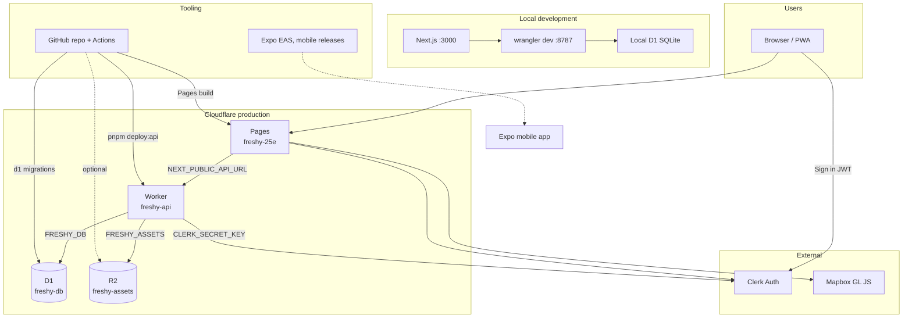
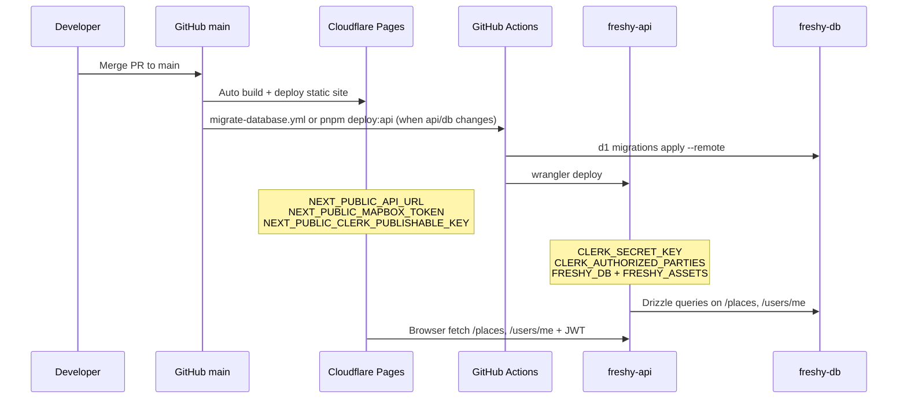

# Freshy | Platforms & services reference

> **Purpose:** Single checklist of every platform Freshy uses, what it does, where to click, and which env vars belong where.  
> **Update this file** when you add or change a provider.

**Production (June 2026):**

| Layer          | Provider          | Live URL                                        |
| -------------- | ----------------- | ----------------------------------------------- |
| Web app        | Cloudflare Pages  | https://freshy-25e.pages.dev                    |
| API            | Cloudflare Worker | https://freshy-api.alexandrelheinen.workers.dev |
| Database       | Cloudflare D1     | `freshy-db` (no public URL)                     |
| Object storage | Cloudflare R2     | `freshy-assets`                                 |
| Auth           | Clerk             | https://dashboard.clerk.com                     |
| Maps           | Mapbox            | Token on Pages                                  |
| Source code    | GitHub            | https://github.com/alexandrelheinen/freshy      |

---

## Cloudflare resource map

| Resource type     | Dashboard name  | Binding / URL                                   | Config file                                                               |
| ----------------- | --------------- | ----------------------------------------------- | ------------------------------------------------------------------------- |
| **Pages project** | `freshy-25e`    | https://freshy-25e.pages.dev                    | Git integration                                                           |
| **Worker**        | `freshy-api`    | https://freshy-api.alexandrelheinen.workers.dev | [`packages/api/wrangler.toml`](../packages/api/wrangler.toml)             |
| **D1 database**   | `freshy-db`     | `FRESHY_DB`                                     | `wrangler.toml` + [`packages/db/migrations/`](../packages/db/migrations/) |
| **R2 bucket**     | `freshy-assets` | `FRESHY_ASSETS`                                 | `wrangler.toml`                                                           |

---

## Platform diagram



---

## 1. GitHub | source code & CI

| Item                      | Value                                                               |
| ------------------------- | ------------------------------------------------------------------- |
| **Dashboard**             | https://github.com/alexandrelheinen/freshy                          |
| **Role**                  | Git repo, pull requests, GitHub Actions CI, release tags for mobile |
| **Branch for production** | `main`                                                              |
| **What you do here**      | Push code, merge PRs, configure Actions secrets                     |

### GitHub Actions secrets

| Secret                  | Used for                                                  |
| ----------------------- | --------------------------------------------------------- |
| `CLOUDFLARE_API_TOKEN`  | Worker deploy + D1 migrations (required for API CD)       |
| `CLOUDFLARE_ACCOUNT_ID` | Wrangler account ID (required for API CD)                 |
| `R2_ACCOUNT_ID`         | Upload CI screenshots to R2 (optional)                    |
| `R2_ACCESS_KEY_ID`      | R2 API (optional)                                         |
| `R2_SECRET_ACCESS_KEY`  | R2 API (optional)                                         |
| `R2_BUCKET_NAME`        | `freshy-assets` (optional)                                |
| `R2_PUBLIC_URL`         | Public URL for screenshot links in PR comments (optional) |
| `EXPO_TOKEN`            | Mobile EAS builds on release (optional)                   |

**Docs:** [.github/workflows/ci.yml](../.github/workflows/ci.yml), [migrate-database.yml](../.github/workflows/migrate-database.yml)

---

## 2. Cloudflare Pages | web app

| Item             | Value                                                              |
| ---------------- | ------------------------------------------------------------------ |
| **Dashboard**    | https://dash.cloudflare.com → **Workers & Pages** → **freshy-25e** |
| **Live site**    | https://freshy-25e.pages.dev                                       |
| **Deploys from** | GitHub `main` (auto on push)                                       |
| **Build root**   | Monorepo build from repo root (see project settings)               |
| **Output**       | Static export (`out/`)                                             |

### Environment variables (Pages)

Set under **Settings → Environment variables** (Production **and** Preview):

| Variable                            | Example / notes                                                          |
| ----------------------------------- | ------------------------------------------------------------------------ |
| `NODE_VERSION`                      | `20`                                                                     |
| `NEXT_PUBLIC_API_URL`               | `https://freshy-api.alexandrelheinen.workers.dev`, **no trailing slash** |
| `NEXT_PUBLIC_MAPBOX_TOKEN`          | Mapbox public token (`pk....`)                                           |
| `NEXT_PUBLIC_CLERK_PUBLISHABLE_KEY` | Clerk publishable key (`pk_test_...`)                                    |
| `NEXT_PUBLIC_R2_PUBLIC_URL`         | Same base as Worker `R2_PUBLIC_URL` (default place photos)               |

**After changing env vars → redeploy** (Deployments → Retry deployment).

**Docs:** [local-development.md](local-development.md), [infrastructure/cloudflare/README.md](../infrastructure/cloudflare/README.md)

---

## 3. Cloudflare Worker | API

| Item             | Value                                                              |
| ---------------- | ------------------------------------------------------------------ |
| **Dashboard**    | https://dash.cloudflare.com → **Workers & Pages** → **freshy-api** |
| **Live API**     | https://freshy-api.alexandrelheinen.workers.dev                    |
| **Health check** | https://freshy-api.alexandrelheinen.workers.dev/health             |
| **Runtime**      | Hono on Cloudflare Workers (`packages/api`)                        |
| **Config**       | [`packages/api/wrangler.toml`](../packages/api/wrangler.toml)      |

### Bindings (wrangler.toml)

| Binding         | Resource           | Purpose         |
| --------------- | ------------------ | --------------- |
| `FRESHY_DB`     | D1 `freshy-db`     | SQLite database |
| `FRESHY_ASSETS` | R2 `freshy-assets` | Object storage  |

### Vars (wrangler.toml)

| Var             | Purpose                        |
| --------------- | ------------------------------ |
| `R2_PUBLIC_URL` | Public base URL for R2 objects |

### Secrets (Worker dashboard or `wrangler secret put`)

Set under **Workers & Pages → freshy-api → Settings → Variables and Secrets**:

| Secret                     | Purpose                                                                                     |
| -------------------------- | ------------------------------------------------------------------------------------------- |
| `CLERK_SECRET_KEY`         | Verify Clerk JWT on API                                                                     |
| `CLERK_AUTHORIZED_PARTIES` | Comma-separated frontend origins, e.g. `https://freshy-25e.pages.dev,http://localhost:3000` |
| `MAPBOX_ACCESS_TOKEN`      | Server-side geocoding on place submit                                                       |

### Deploy commands

```bash
pnpm build:api
pnpm db:migrate:remote    # skip if D1 already migrated
pnpm deploy:api
```

Or run `pnpm migrate:deploy:production` and `pnpm deploy:api` with Cloudflare credentials.

### Wrangler auth (local deploy)

If `migrate:remote` or `deploy:api` fails with **code 7403** (account not authorized), Wrangler is not authenticated for the Cloudflare account that owns `freshy-db`.

**Option A | Login (interactive)**

```bash
cd packages/api
pnpm exec wrangler login
pnpm exec wrangler whoami   # confirm account matches your dashboard
```

**Option B | API token (CI or non-interactive)**

Create a token at https://dash.cloudflare.com/profile/api-tokens with **Workers Scripts Edit** and **D1 Edit** permissions, then:

```bash
export CLOUDFLARE_API_TOKEN="your-token"
export CLOUDFLARE_ACCOUNT_ID="your-account-id"   # right sidebar in dashboard
pnpm db:migrate:remote
pnpm deploy:api
```

**Skip migrate if D1 is already up to date.** If you imported data and applied `0001_init.sql` earlier, go straight to `pnpm deploy:api` after `pnpm build:api`.

**Do not use** `pnpm --filter @freshy/api deploy` — `deploy` is a reserved pnpm command. Use `pnpm deploy:api` or `pnpm --filter @freshy/api run deploy`.

### Manual deploy (when the dashboard has no Deploy button)

Workers deployed via Wrangler or GitHub Actions often **do not show a Deploy button** in the dashboard. Use the CLI from your machine:

```bash
cd packages/api

# 1. Restore secrets (one-time, or after they were deleted)
pnpm exec wrangler secret put CLERK_SECRET_KEY
pnpm exec wrangler secret put CLERK_AUTHORIZED_PARTIES
pnpm exec wrangler secret put MAPBOX_ACCESS_TOKEN

# 2. Build and deploy
cd ../..
pnpm build:api
pnpm db:migrate:remote    # skip if D1 already migrated
pnpm deploy:api
```

Dashboard path for secrets: **Workers & Pages → freshy-api → Settings → Variables and Secrets → Add**.

`CLERK_AUTHORIZED_PARTIES` value example:

```text
https://freshy-25e.pages.dev,http://localhost:3000
```

**Note:** `GET /` returns 404 by design. Use `/health` or `/places` instead. After deploy, `/` redirects to `/health`.

### Verify health

```bash
curl -s https://freshy-api.alexandrelheinen.workers.dev/health | jq
```

Expected: `"status":"ok"`, `"service":"freshy-api-worker"`, `"db":"ok"`, `"auth":"configured"`.

---

## 4. Cloudflare D1 | database

| Item           | Value                                                                      |
| -------------- | -------------------------------------------------------------------------- |
| **Dashboard**  | https://dash.cloudflare.com → **Workers & Pages** → **D1** → **freshy-db** |
| **Binding**    | `FRESHY_DB`                                                                |
| **Engine**     | SQLite (D1)                                                                |
| **ORM**        | Drizzle                                                                    |
| **Migrations** | [`packages/db/migrations/`](../packages/db/migrations/)                    |

### What you do here

| Task                      | How                                          |
| ------------------------- | -------------------------------------------- |
| Apply migrations (local)  | `pnpm --filter @freshy/db migrate:local`     |
| Apply migrations (remote) | `pnpm --filter @freshy/db migrate:remote`    |
| Query data                | D1 console → **freshy-db** → SQL editor      |
| Export / import           | `wrangler d1 export` / `wrangler d1 execute` |

**Docs:** [database.md](database.md)

---

## 5. Cloudflare R2 | object storage

| Item           | Value                                                    |
| -------------- | -------------------------------------------------------- |
| **Dashboard**  | https://dash.cloudflare.com → **R2** → **freshy-assets** |
| **Binding**    | `FRESHY_ASSETS` (Worker native binding)                  |
| **Public URL** | Set in `R2_PUBLIC_URL` (wrangler.toml vars)              |
| **Role**       | Place photos, avatars, CI screenshots                    |

### Bucket prefixes

| Prefix             | Content                       |
| ------------------ | ----------------------------- |
| `places/`          | Venue photos                  |
| `places/defaults/` | Category default place photos |
| `avatars/`         | User profile images           |
| `ci/`              | PR screenshot previews        |
| `ci/main/latest/`  | Production page screenshots   |

**Docs:** [infrastructure/cloudflare/README.md](../infrastructure/cloudflare/README.md)

---

## 6. Clerk | authentication

| Item            | Value                                        |
| --------------- | -------------------------------------------- |
| **Dashboard**   | https://dashboard.clerk.com                  |
| **Application** | **Freshy**                                   |
| **Role**        | Sign-in, JWT sessions, user profile metadata |

### Keys (Configure → API keys)

| Key                 | Starts with   | Goes on                                                |
| ------------------- | ------------- | ------------------------------------------------------ |
| **Publishable key** | `pk_test_...` | Cloudflare Pages → `NEXT_PUBLIC_CLERK_PUBLISHABLE_KEY` |
| **Secret key**      | `sk_test_...` | Worker secret → `CLERK_SECRET_KEY`                     |

### Verify auth

1. `GET /health` → `"auth":"configured"`
2. https://freshy-25e.pages.dev/profile → Sign in works
3. Save a place → appears on profile

### Studio admin

Grant `publicMetadata.role: "admin"` on operator accounts. See **[studio.md](studio.md)**.

---

## 7. Mapbox | map tiles

| Item          | Value                                     |
| ------------- | ----------------------------------------- |
| **Dashboard** | https://account.mapbox.com                |
| **Tokens**    | https://account.mapbox.com/access-tokens/ |
| **Role**      | Map on `/explore`                         |

| Variable                   | Where                                    |
| -------------------------- | ---------------------------------------- |
| `NEXT_PUBLIC_MAPBOX_TOKEN` | Cloudflare Pages (public token `pk....`) |
| `MAPBOX_ACCESS_TOKEN`      | Worker secret (geocoding)                |

Local: same variables in root `.env`.

---

## 8. Expo EAS | mobile WebView shell

| Item          | Value                                                                 |
| ------------- | --------------------------------------------------------------------- |
| **App**       | `apps/mobile` — native shell loading `EXPO_PUBLIC_WEB_APP_URL`        |
| **Dashboard** | https://expo.dev                                                      |
| **CI**        | `.github/workflows/release.yml` on GitHub **Release published**      |
| **Outputs**   | Android `.apk` + iOS `.ipa` attached to the release                 |

### One-time setup

```bash
pnpm install
cd apps/mobile
pnpm exec eas login
pnpm exec eas init          # links project; copy projectId to EAS_PROJECT_ID in .env
```

After `eas init`, confirm linking with `pnpm exec eas project:info`. Step-by-step from there (tokens, builds, GitHub releases): **[mobile-setup.md](mobile-setup.md)**.

GitHub repository secrets:

| Secret | Value |
| ------ | ----- |
| **`EXPO_TOKEN`** | Token from https://expo.dev/settings/access-tokens |
| **`EAS_PROJECT_ID`** | UUID from `eas init` (same as in `.env`) |

iOS device installs use **ad hoc** signing. Register test devices:

```bash
cd apps/mobile
pnpm exec eas device:create
```

Apple Developer Program membership is required for iOS builds.

### Local commands (from repository root)

| Command | Result |
| ------- | ------ |
| `pnpm mobile:dev` | Expo dev server (WebView shell) |
| `pnpm mobile:build:android` | EAS build → signed APK |
| `pnpm mobile:build:ios` | EAS build → signed IPA (registered devices) |
| `pnpm mobile:build` | Both platforms |
| `pnpm mobile:download:android` | Download latest APK to `dist/mobile/` |
| `pnpm mobile:download:ios` | Download latest IPA to `dist/mobile/` |

Optional override for staging:

```bash
EXPO_PUBLIC_WEB_APP_URL=https://freshy-25e.pages.dev pnpm mobile:build:android
```

### Release automation

Publishing a GitHub release (tag `v*`) runs EAS with profile **`release`**, downloads artifacts, and attaches:

- `freshy-<tag>-android.apk`
- `freshy-<tag>-ios.ipa`

Manual dry run: **Actions → Release \| Mobile builds → Run workflow** (uploads artifacts without a release).

---

## Deploy pipeline (production)



---

## Master checklist | new environment or disaster recovery

- [ ] **GitHub**: repo cloned, `pnpm install` works locally
- [ ] **Cloudflare D1**: `freshy-db` created, migrations applied
- [ ] **Cloudflare Worker**: `freshy-api` deployed with D1 + R2 bindings
- [ ] **Worker secrets**: `CLERK_SECRET_KEY`, `CLERK_AUTHORIZED_PARTIES`, `MAPBOX_ACCESS_TOKEN`
- [ ] **Cloudflare Pages**: `freshy-25e`, API URL + Mapbox + Clerk publishable key + R2 public URL
- [ ] **Clerk**: Freshy app, keys copied to Worker + Pages
- [ ] **Mapbox**: public token on Pages
- [ ] **GitHub secrets**: `CLOUDFLARE_API_TOKEN`, `CLOUDFLARE_ACCOUNT_ID`
- [ ] **Verify**: `/health` db ok + auth configured, `/explore` shows map, `/profile` sign-in, save place works
- [ ] **(Optional) R2 + GitHub secrets**: PR screenshot previews
- [ ] **(Optional) EAS**: `EXPO_TOKEN`, `EAS_PROJECT_ID`, `pnpm mobile:build`

---

## Quick links

| Platform             | URL                                             |
| -------------------- | ----------------------------------------------- |
| Live web app         | https://freshy-25e.pages.dev                    |
| Live API             | https://freshy-api.alexandrelheinen.workers.dev |
| GitHub repo          | https://github.com/alexandrelheinen/freshy      |
| Cloudflare dashboard | https://dash.cloudflare.com                     |
| Clerk dashboard      | https://dashboard.clerk.com                     |
| Mapbox tokens        | https://account.mapbox.com/access-tokens/       |

---

## Related docs

| Doc                                          | Contents                         |
| -------------------------------------------- | -------------------------------- |
| [local-development.md](local-development.md) | Local setup with wrangler dev    |
| [database.md](database.md)                   | Schema, migrations, Drizzle      |
| [infrastructure.md](infrastructure.md)       | Cloudflare services and bindings |
| [architecture.md](architecture.md)           | Monorepo layout, data flow       |
| [.env.example](../.env.example)              | All env var names                |

_Last updated: June 2026_
