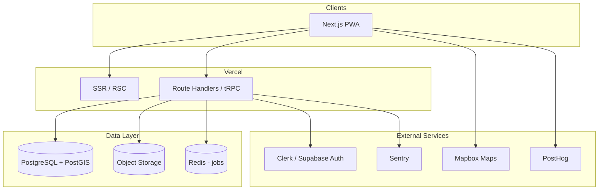

# Freshy — Stack, Infrastructure & Development Roadmap

> Reference designs: [`docs/stitch/`](stitch/) (Stitch export)  
> Design system: [`docs/stitch/freshy/DESIGN.md`](stitch/freshy/DESIGN.md)

---

## 1. What Freshy Is

**Freshy** is a mobile-first **cooling map** — a discovery app that helps people escape urban heat by finding nearby places with reliable air conditioning and thermal comfort.

**Target users:** commuters, tourists, and remote workers moving through hot cities.

**Core value proposition:** not “where is this place?” but **“how cool is it inside, right now?”**

### Screens in scope (from Stitch)

| Screen                                              | Role                                                                                        |
| --------------------------------------------------- | ------------------------------------------------------------------------------------------- |
| **Mapa Freshy** (`mapa_freshy`)                     | Home / Explore — interactive map, search, category chips, nearby place preview card         |
| **Categorias de Lugares** (`categorias_de_lugares`) | Cooling tab — browse by category (cafés, restaurants, libraries, malls, museums, coworking) |
| **Detalhes do Local** (`detalhes_do_local`)         | Place detail — temperature, AC strength, amenities, directions, climate reviews             |
| **Meu Perfil** (`meu_perfil`)                       | Profile — saved places, user reviews, gamification (“Pontos de Alívio”)                     |

### Key product concepts

- **Coolness / AC strength** — 3-tier scale (Lightly Cooled → Comfortable → Frigid), visualized as segmented bars or snowflake icons
- **Interior temperature** — reported or aggregated °C reading per place
- **Climate reviews** — reviews focused on AC quality, not generic 5-star ratings
- **Amenity tags** — e.g. Free Wi-Fi, Quiet Zone, Comfy Seating
- **Categories** — typed venues with counts per city
- **Saved places** — personal bookmarks
- **Relief Points** — lightweight gamification for contributing reviews

UI language in the designs is **Brazilian Portuguese**; architecture should support i18n from the start.

---

## 2. Recommended Stack

### Guiding principles

1. **Align with the Stitch export** — Tailwind CSS, Inter, Material Symbols, glassmorphic mobile UI
2. **Map-first** — geospatial queries are a first-class concern
3. **Ship a PWA fast** — designs are mobile-native; avoid native apps until traction
4. **Crowdsourced data** — schema and moderation built around user-contributed cooling ratings

### Languages

| Layer            | Choice                                                | Why                                |
| ---------------- | ----------------------------------------------------- | ---------------------------------- |
| **Frontend**     | TypeScript                                            | Type safety, shared types with API |
| **Backend**      | TypeScript                                            | Same language across the monorepo  |
| **Database**     | SQL (PostgreSQL)                                      | Relational data + PostGIS for geo  |
| **Infra config** | YAML (GitHub Actions), HCL optional (Terraform later) | Standard CI/CD                     |

### Application layer

| Concern                   | Technology                                     | Notes                                                 |
| ------------------------- | ---------------------------------------------- | ----------------------------------------------------- |
| **Framework**             | [Next.js 15](https://nextjs.org/) (App Router) | SSR/SSG for SEO, API routes, PWA support              |
| **UI**                    | React 19 + Tailwind CSS 4                      | Direct port from Stitch HTML; tokens from `DESIGN.md` |
| **Component primitives**  | Radix UI or shadcn/ui                          | Accessible dialogs, sheets, tabs                      |
| **Maps**                  | [Mapbox GL JS](https://www.mapbox.com/)        | Custom cool-toned map style; strong marker clustering |
| **State / data fetching** | TanStack Query + Zustand                       | Server state + light client state (map filters)       |
| **Forms & validation**    | React Hook Form + Zod                          | Review submission, profile edits                      |
| **i18n**                  | next-intl                                      | pt-BR default, en later                               |

**Alternative considered:** Expo/React Native for a store app — defer until post-MVP; PWA covers mobile web first.

### Backend & data

| Concern             | Technology                                                                | Notes                                                    |
| ------------------- | ------------------------------------------------------------------------- | -------------------------------------------------------- |
| **API**             | Next.js Route Handlers + tRPC or REST                                     | Start colocated; extract to standalone service if needed |
| **ORM**             | Prisma                                                                    | Migrations, type-safe queries                            |
| **Database**        | PostgreSQL 16 + **PostGIS**                                               | `ST_DWithin`, spatial indexes for “near me”              |
| **Auth**            | [Clerk](https://clerk.com/) or [Supabase Auth](https://supabase.com/auth) | Social login (Google), JWT sessions                      |
| **File storage**    | Cloudflare R2 or Supabase Storage                                         | Place photos, avatars                                    |
| **Search**          | PostgreSQL full-text + PostGIS filters                                    | Upgrade to Meilisearch if search latency matters         |
| **Background jobs** | Inngest or BullMQ + Redis                                                 | Score aggregation, image processing, notifications       |

### External services

| Service                                  | Purpose                                            |
| ---------------------------------------- | -------------------------------------------------- |
| **Mapbox** (or Google Maps Platform)     | Base map tiles, geocoding, turn-by-turn deep links |
| **OpenWeather / Tomorrow.io** (optional) | Outdoor heat context (“heat wave alert”)           |
| **Resend / SendGrid**                    | Transactional email (welcome, review reminders)    |
| **Sentry**                               | Error monitoring                                   |
| **PostHog** or Plausible                 | Product analytics (privacy-friendly)               |

### DevOps & infrastructure

| Concern           | Technology                                             |
| ----------------- | ------------------------------------------------------ |
| **Hosting (app)** | Vercel                                                 |
| **Hosting (DB)**  | Neon or Supabase (managed Postgres + PostGIS)          |
| **CDN / edge**    | Vercel Edge / Cloudflare                               |
| **CI/CD**         | GitHub Actions — lint, typecheck, test, preview deploy |
| **Secrets**       | Vercel env vars + GitHub encrypted secrets             |
| **IaC (later)**   | Terraform or Pulumi when multi-env complexity grows    |

### Monorepo layout (proposed)

```
freshy/
├── apps/
│   └── web/                 # Next.js PWA
├── packages/
│   ├── db/                  # Prisma schema + client
│   ├── ui/                  # Shared components (design tokens)
│   └── config/              # ESLint, TS, Tailwind presets
├── docs/
│   ├── stitch/              # Design reference (existing)
│   └── roadmap.md           # This file
└── .github/workflows/
```

---

## 3. Data Model (high level)

```
User
  ├── profile (displayName, avatar, reliefPoints)
  ├── savedPlaces[]
  └── reviews[]

Place
  ├── name, slug, description
  ├── location (lat, lng, address)      # PostGIS geography
  ├── category (enum)
  ├── amenities[] (wifi, quiet_zone, …)
  ├── photos[]
  ├── openingHours
  ├── aggregatedCoolnessScore           # computed
  ├── aggregatedTemperatureC            # computed
  └── reviews[]

Review (“Avaliação Climática”)
  ├── userId, placeId
  ├── acStrength (1–5)
  ├── temperatureC (optional)
  ├── comment
  └── createdAt

Category
  └── slug, label, icon, placeCount (cached)
```

**Coolness aggregation (v1):** weighted average of recent reviews; decay older contributions; flag outliers for moderation.

---

## 4. Development Roadmap

Phases are ordered by dependency. Each phase ends with something demoable.

---

### Phase 0 — Foundation

**Goal:** Runnable project skeleton aligned with the design system.

- [x] Initialize monorepo (pnpm workspaces + Turborepo)
- [x] Scaffold Next.js app with TypeScript, Tailwind, ESLint, Prettier
- [x] Port design tokens from `docs/stitch/freshy/DESIGN.md` into `tailwind.config.ts`
- [x] Add shared UI shell: `TopAppBar`, `BottomNavBar`, glass card primitives
- [x] Set up Prisma + PostgreSQL (local Docker Compose with PostGIS image)
- [x] Configure GitHub Actions: install, lint, typecheck
- [ ] Deploy empty shell to Vercel (preview + production)

**Exit criteria:** App loads with correct branding, typography, and bottom navigation — no real data yet.

---

### Phase 1 — Places & Map (read-only MVP)

**Goal:** Explore screen works with real geo data on a map.

- [ ] Define Prisma schema: `Place`, `Category`
- [ ] Seed database with ~50 sample venues in one pilot city (e.g. São Paulo or Porto)
- [ ] Integrate Mapbox GL JS with custom light/cool map style
- [ ] Implement geolocation (“you are here” marker)
- [ ] Render place markers with coolness-based color intensity
- [ ] Build floating search bar + category filter chips (client-side filter first)
- [ ] Bottom preview card when a marker is selected (name, distance, temp, AC bar)
- [ ] API: `GET /places?lat&lng&radius&category&q`

**Exit criteria:** User opens app, sees map, taps pins, reads preview card. Matches `mapa_freshy` screen.

---

### Phase 2 — Place Detail & Navigation

**Goal:** Full place page with static/seeded content.

- [ ] Route: `/places/[slug]`
- [ ] Hero image, open/closed badge, interior temperature, AC strength component
- [ ] Amenity chips, description, mini-map section
- [ ] “Como Chegar” — deep link to Google Maps / Waze / Apple Maps
- [ ] Share place (Web Share API + fallback copy link)
- [ ] API: `GET /places/:slug`

**Exit criteria:** Tapping a marker → detail page. Matches `detalhes_do_local` screen.

---

### Phase 3 — Categories & Cooling Tab

**Goal:** Browse places by type without the map.

- [ ] Route: `/cooling` (Categories screen)
- [ ] Category grid with live counts from DB
- [ ] “Destaque de Hoje” — featured place (editorial flag or highest score)
- [ ] Category drill-down list view
- [ ] Wire bottom nav: Explore ↔ Cooling ↔ Profile

**Exit criteria:** Cooling tab matches `categorias_de_lugares` screen.

---

### Phase 4 — Auth & User Profile

**Goal:** Accounts, saved places, basic profile.

- [ ] Integrate Clerk or Supabase Auth (Google + email)
- [ ] Route: `/profile` — avatar, username, stats (reviews count, saved count)
- [ ] Saved places: toggle bookmark on detail page; horizontal carousel on profile
- [ ] API: `POST/DELETE /users/me/saved/:placeId`, `GET /users/me`

**Exit criteria:** Logged-in user saves places and sees them on profile. Matches `meu_perfil` shell (reviews empty until Phase 5).

---

### Phase 5 — Climate Reviews & Gamification

**Goal:** Crowdsourced cooling data — the product’s core loop.

- [ ] Review form on place detail: AC strength (1–5), optional temperature, comment
- [ ] List climate reviews on place page; pagination
- [ ] Recompute `aggregatedCoolnessScore` and `aggregatedTemperatureC` on new review (background job)
- [ ] User review history on profile
- [ ] Relief Points: +N points per review; display badge on profile
- [ ] Basic moderation: report review, rate-limit new users
- [ ] API: `POST /places/:id/reviews`, `GET /places/:id/reviews`

**Exit criteria:** User submits a review; map markers and detail page reflect updated scores.

---

### Phase 6 — Search, Filters & PWA

**Goal:** Production-quality discovery experience.

- [ ] Server-side search (name, address, category) with debounced input
- [ ] Voice search hook (Web Speech API — optional, progressive enhancement)
- [ ] Sort: nearest, coldest, highest AC rating
- [ ] PWA manifest, service worker, install prompt, offline shell
- [ ] Push notification groundwork (heat alerts — optional)

**Exit criteria:** Search “biblioteca” → filtered map results. App installable on mobile home screen.

---

### Phase 7 — Admin, Data Quality & Launch

**Goal:** Operate and grow the place database safely.

- [ ] Admin UI (protected): approve new places, edit categories, feature “Destaque”
- [ ] Place submission flow (user suggests a new venue → moderation queue)
- [ ] Image upload for places (R2/Supabase Storage + resize pipeline)
- [ ] Sentry + PostHog wired in production
- [ ] Privacy policy, terms, LGPD-oriented consent for location data
- [ ] Load test geo queries; add DB indexes (`GIST` on geography column)
- [ ] Soft launch in one city; gather feedback

**Exit criteria:** Team can moderate content; app stable under initial user load.

---

### Phase 8 — Post-MVP (backlog)

Not required for first launch; plan when core loop is validated.

| Item                   | Notes                                                   |
| ---------------------- | ------------------------------------------------------- |
| Native apps (Expo)     | If PWA retention is insufficient                        |
| Real-time AC status    | Venue partners update “AC on/off” live                  |
| Heat map overlay       | Outdoor temperature layers on map                       |
| Multi-city expansion   | City selector, localized seed data                      |
| Meilisearch            | If PostgreSQL search becomes slow                       |
| Venue partner portal   | Businesses claim and verify their listing               |
| Standalone API service | Extract from Next.js if mobile apps need shared backend |

---

## 5. Architecture Diagram



---

## 6. Non-Functional Requirements

| Area              | Target                                                                          |
| ----------------- | ------------------------------------------------------------------------------- |
| **Performance**   | LCP < 2.5s on 4G; map markers for 500 places without jank (clustering)          |
| **Availability**  | 99.5% uptime (Vercel + managed Postgres)                                        |
| **Security**      | HTTPS only, OWASP top 10, auth on all write endpoints, input validation via Zod |
| **Privacy**       | Location used only with consent; no selling of location data (LGPD)             |
| **Accessibility** | WCAG 2.1 AA on core flows (map is hardest — provide list fallback)              |

---

## 7. Team & Skills Needed

| Role                          | Focus                                                |
| ----------------------------- | ---------------------------------------------------- |
| **Full-stack engineer**       | Next.js, Prisma, PostGIS, API design                 |
| **Frontend engineer**         | Tailwind, Mapbox, mobile PWA polish                  |
| **Designer (part-time)**      | Stitch → component parity, edge states, empty states |
| **Product / ops (part-time)** | Seed data, moderation, pilot city partnerships       |

A single strong full-stack developer can execute Phases 0–5; Phase 7 benefits from a second pair of hands.

---

## 8. Immediate Next Steps

1. **Phase 0 kickoff** — scaffold monorepo and port design tokens
2. **Pick pilot city** — determines seed data and map center
3. **Choose auth provider** — Clerk (fastest) vs Supabase (DB bundled)
4. **Mapbox account** — custom style matching Freshy cool palette
5. **Convert Stitch screens** — use `docs/stitch/*/code.html` as layout reference while building React components

---

_Last updated: June 2026_
