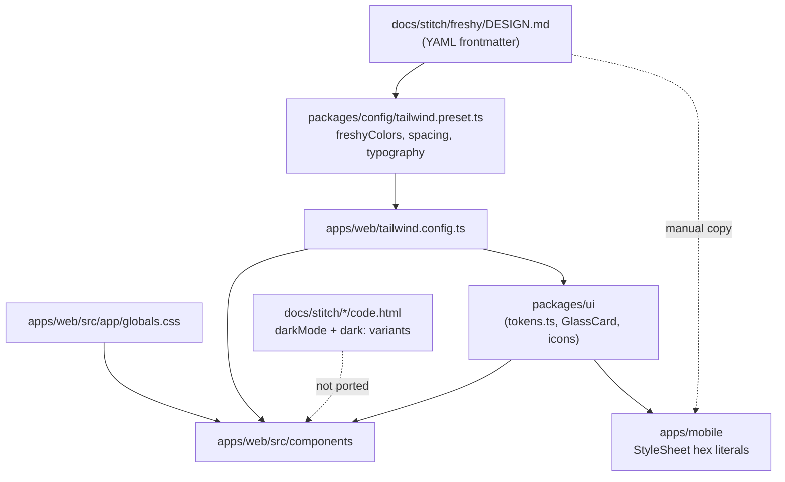

# Theme Modularity | Technical Specification

This document defines how Freshy must structure visual tokens so a new theme is added by editing configuration files, not application code. It supersedes the informal study from the initial theming conversation and reflects the repository state as of June 2026.

**Scope:** specification only. Implementation follows [development-cycle.md](../development-cycle.md) (TDD, `validation.sh`, PR to `main`).

**Companion:** [dark-theme-spec.md](dark-theme-spec.md) describes the first alternate theme built on this foundation.

---

## 1. Current state review

### 1.1 What exists today



| Layer             | Location                             | Notes                                                                   |
| ----------------- | ------------------------------------ | ----------------------------------------------------------------------- |
| Design reference  | `docs/stitch/freshy/DESIGN.md`       | YAML mirrors preset values; prose describes glass, functional colors    |
| Web runtime       | `packages/config/tailwind.preset.ts` | 48 Material Design 3-style color roles, spacing, typography, radius     |
| Tailwind consumer | `apps/web/tailwind.config.ts`        | Imports `@freshy/config/tailwind` preset                                |
| Domain constants  | `packages/ui/src/tokens.ts`          | Brand, routes, nav/category/amenity **icon names**; no colors           |
| Icons             | `packages/ui/src/icons.tsx`          | `MaterialIcon` + `MaterialIconName` union (~65 glyphs)                  |
| Global CSS        | `apps/web/src/app/globals.css`       | `.glass`, marker animations, status bar, slider thumb with raw hex/rgba |
| Mobile            | `apps/mobile/app/**/*.tsx`           | Hardcoded hex in every screen (~6 files)                                |

### 1.2 What changed since Phase 0

Phase 0 delivered a **shared Tailwind preset** (`@freshy/config/tailwind`) and semantic utility usage across web components. Recent work (Studio, icon name updates) did **not** alter the token architecture.

| Area                             | Status                                        |
| -------------------------------- | --------------------------------------------- |
| Centralized preset               | Done                                          |
| Semantic Tailwind classes on web | Mostly done (~14 component files)             |
| `packages/theme` package         | Not started                                   |
| CSS custom properties            | Not started                                   |
| Dark mode in app                 | Not started (exists only in Stitch mocks)     |
| Mobile token sharing             | Not started                                   |
| Lint ban on raw hex in apps      | Not started                                   |
| Tailwind v4                      | Documented in roadmap; **runtime is v3.4.17** |

### 1.3 Applicability of the prior study

The earlier modularity proposal remains **valid and recommended** with these adjustments for the current repo:

| Prior proposal                       | Still applies? | Adjustment                                                                                                         |
| ------------------------------------ | -------------- | ------------------------------------------------------------------------------------------------------------------ |
| `packages/theme` with YAML per theme | Yes            | Keep; do not put theme values back into `tailwind.preset.ts` long term                                             |
| CSS variables + `data-theme`         | Yes            | Use Tailwind v3 `theme.extend` mapping to `var(--color-*)`; defer Tailwind v4 `@theme` until a dedicated migration |
| Move icon maps to theme config       | Yes            | `NAV_ICONS`, `PLACE_CATEGORY_ICONS`, etc. move to generated theme exports; domain labels stay in `tokens.ts`       |
| `effects.yaml` for glass/shadows     | Yes            | Required before dark theme; white-centric leaks block alternate themes                                             |
| ESLint/CI hex ban                    | Yes            | Add in Phase B of rollout                                                                                          |
| Stitch as second source of truth     | Revise         | `DESIGN.md` becomes **documentation**; authoritative values live under `packages/theme/themes/`                    |
| Immediate multi-theme picker UI      | Defer          | Ship infrastructure + dark first; profile toggle in a follow-up                                                    |

### 1.4 Remaining leaks (must close before multi-theme)

These violate the rule **no literal colors in application code**:

| File / area                                                    | Issue                                                                |
| -------------------------------------------------------------- | -------------------------------------------------------------------- |
| `apps/web/src/app/globals.css`                                 | `#e0e3e5`, `#0c6780`, `rgba(255,255,255,0.8)`                        |
| `apps/web/src/app/layout.tsx`                                  | `themeColor: '#0c6780'`                                              |
| `packages/ui/src/index.tsx` (`GlassCard`)                      | `border-white/40`, `bg-white/80`                                     |
| `PlaceListCard.tsx`, `PlaceDetailClient.tsx`                   | `shadow-[0_4px_20px_rgba(12,103,128,0.04)]`                          |
| `AppNav.tsx`                                                   | `shadow-[0_-4px_20px_rgba(0,0,0,0.04)]`                              |
| `map-markers.tsx`, `ExploreMapClient.tsx`, `CoolingClient.tsx` | `text-white`, `border-white`, `bg-white/*` instead of semantic roles |
| `apps/mobile/**`                                               | All `StyleSheet` hex literals                                        |

Functional colors (`success`, `warning`) appear in `DESIGN.md` prose but are **missing** from `freshyColors`.

---

## 2. Goals and non-goals

### Goals

1. **One configuration surface per theme** — a folder of text files (YAML) defines colors, effects, typography, spacing, radius, motion, and optional icon overrides.
2. **Semantic names only in components** — `bg-primary`, `text-on-hero`, `shadow-card`; never `#0c6780` or `rgba(...)` in `apps/` or `packages/ui`.
3. **Runtime theme switching** — swap active theme via `data-theme` on `<html>` without rebuild (web). Mobile reads the same generated token objects.
4. **Extensibility** — adding `playful`, `high-contrast`, or `daltonic` themes is copying a folder and filling values, then registering in the theme index.
5. **Validation** — schema checks, contrast tests for accessibility themes, CI grep for forbidden literals.

### Non-goals (this spec)

- Implementing alternate themes beyond defining how they plug in (dark theme has its own spec).
- Tailwind v4 migration (noted as a future alignment task).
- Clerk appearance theming and Mapbox style theming (listed as Phase D follow-ups).
- User-facing theme picker UX (specified only as a hook point).

---

## 3. Target package layout

New workspace package: **`@freshy/theme`**

```
packages/theme/
├── package.json
├── tsconfig.json
├── schema/
│   ├── color-roles.schema.json      # JSON Schema: required keys for every theme
│   ├── effects-roles.schema.json
│   └── icon-slots.schema.json
├── roles/
│   ├── colors.roles.yaml            # Role names + descriptions (no values)
│   ├── effects.roles.yaml
│   ├── typography.roles.yaml
│   ├── spacing.roles.yaml
│   ├── radius.roles.yaml
│   ├── motion.roles.yaml
│   └── icons.roles.yaml             # Semantic slots (nav.explore, category.cafe, …)
├── themes/
│   ├── default/                     # Current light theme (rename from today's palette)
│   │   ├── theme.meta.yaml          # id, label, colorScheme, extends (optional)
│   │   ├── colors.yaml
│   │   ├── effects.yaml
│   │   ├── typography.yaml
│   │   ├── spacing.yaml
│   │   ├── radius.yaml
│   │   ├── motion.yaml
│   │   └── icons.yaml               # Optional overrides; falls back to roles defaults
│   ├── dark/
│   │   └── … (same file set)
│   ├── high-contrast/
│   ├── daltonic/
│   └── playful/
├── compiler/
│   ├── compile-themes.ts            # YAML → CSS + TS
│   └── compile-themes.test.ts
├── generated/                       # Committed build output
│   ├── default.css
│   ├── dark.css
│   ├── default.tokens.ts
│   ├── dark.tokens.ts
│   └── index.ts                     # Theme registry + types
└── README.md                        # Package-local dev notes (not user docs)
```

### 3.1 Exports

| Import path               | Consumer                | Contents                                                      |
| ------------------------- | ----------------------- | ------------------------------------------------------------- |
| `@freshy/theme/css`       | `apps/web` layout       | Aggregated CSS variable blocks per theme                      |
| `@freshy/theme/tokens`    | Mobile, tests, metadata | `getThemeTokens(themeId)` typed objects                       |
| `@freshy/theme/registry`  | Theme provider          | `THEME_IDS`, labels, `colorScheme` metadata                   |
| `@freshy/config/tailwind` | Tailwind preset         | Maps utilities → `var(--color-*)` (reads role names, not hex) |

`packages/config/tailwind.preset.ts` becomes a **thin adapter**: it wires Tailwind `theme.extend` to CSS variable names defined by `@freshy/theme/roles`, not to hex literals.

---

## 4. Token categories and naming

### 4.1 Color roles

Retain existing Material Design 3-style names from `freshyColors` (48 roles). Add missing functional and composite roles:

| Group                | Roles                                                                                                                                                                                                                          | Notes                                    |
| -------------------- | ------------------------------------------------------------------------------------------------------------------------------------------------------------------------------------------------------------------------------ | ---------------------------------------- |
| Brand                | `primary`, `on-primary`, `primary-container`, `on-primary-container`, `primary-fixed`, `primary-fixed-dim`, `on-primary-fixed`, `on-primary-fixed-variant`, `inverse-primary`, `surface-tint`                                  | Unchanged from preset                    |
| Neutrals             | `surface`, `surface-dim`, `surface-bright`, `surface-container-*`, `surface-variant`, `background`, `on-background`, `on-surface`, `on-surface-variant`, `outline`, `outline-variant`, `inverse-surface`, `inverse-on-surface` | Unchanged                                |
| Secondary / tertiary | Full `secondary*`, `tertiary*` families including `*-fixed` variants                                                                                                                                                           | Unchanged                                |
| Error                | `error`, `on-error`, `error-container`, `on-error-container`                                                                                                                                                                   | Unchanged                                |
| Functional           | `success`, `on-success`, `success-container`, `on-success-container`, `warning`, `on-warning`, `warning-container`, `on-warning-container`                                                                                     | New; values from DESIGN.md prose         |
| Glass                | `glass-surface`, `glass-border`, `glass-highlight`                                                                                                                                                                             | Replace `white/80`, `white/40`           |
| Scrim                | `scrim-strong`, `scrim-weak`                                                                                                                                                                                                   | Replace `black/70`, `inverse-surface/40` |
| Map chrome           | `marker-fill`, `marker-border`, `marker-label-bg`, `marker-label-text`, `marker-ring`                                                                                                                                          | Replace raw white on map markers         |

**Rule:** components reference role names. Values live only in `themes/<id>/colors.yaml`.

### 4.2 Effects roles (`effects.yaml`)

```yaml
glass:
  surface-bg: 'rgba(255, 255, 255, 0.8)'
  surface-border: 'rgba(255, 255, 255, 0.4)'
  blur: '15px'

shadow:
  card: '0 4px 20px rgba(12, 103, 128, 0.04)'
  card-elevated: '0 20px 20px rgba(12, 103, 128, 0.04)'
  nav: '0 -4px 20px rgba(0, 0, 0, 0.04)'
  floating: '0 2px 4px rgba(0, 0, 0, 0.1)'

border-emphasis:
  subtle: '0.1' # opacity multiplier for outline-variant borders
  default: '0.2'
  strong: '0.3'
```

Compiled to `--effect-glass-surface-bg`, `--shadow-card`, etc.

### 4.3 Typography, spacing, radius, motion

Port existing `freshyTypography`, `freshySpacing`, and preset `borderRadius` into per-theme YAML. Most themes share the same scale; only `playful` might increase radius.

Motion tokens (new):

```yaml
duration:
  fast: '150ms'
  normal: '200ms'
  slow: '300ms'
easing:
  default: 'cubic-bezier(0.4, 0, 0.2, 1)'
  bounce: 'cubic-bezier(0.34, 1.56, 0.64, 1)'
```

### 4.4 Icon slots (`icons.yaml`)

Semantic slot → Material Symbol name. Default slot map is shared; themes override individual slots.

```yaml
brand: nest_farsight_cool
nav:
  explore: explore
  saved: bookmark_heart
  cooling: climate_mini_split
  profile: digital_wellbeing
category:
  cafe: local_cafe
  restaurant: restaurant
  # …
amenity:
  free_wifi: wifi
  quiet_zone: volume_off
  # …
```

`packages/ui/src/tokens.ts` keeps **labels and domain types** (`PlaceCategory`, `AMENITY_LABELS`). Glyph strings move to `@freshy/theme` generated exports. Components use `useThemeIcons()` or static imports from `@freshy/theme/tokens`.

---

## 5. Build pipeline

### 5.1 Compile step

Script: `packages/theme/compiler/compile-themes.ts`

**Input:** `themes/<id>/*.yaml` + `roles/*.yaml` (for defaults and validation).

**Output per theme:**

1. **`generated/<id>.css`**

```css
[data-theme='default'] {
  --color-primary: #0c6780;
  --color-on-primary: #ffffff;
  --effect-glass-surface-bg: rgba(255, 255, 255, 0.8);
  --shadow-card: 0 4px 20px rgba(12, 103, 128, 0.04);
  /* … all roles … */
}

:root,
[data-theme='default'] {
  color-scheme: light;
}
```

2. **`generated/<id>.tokens.ts`** — plain objects for React Native and non-CSS consumers:

```typescript
export const colors = { primary: '#0c6780' /* … */ } as const;
export const effects = { glass: { surfaceBg: 'rgba(...)' } /* … */ } as const;
```

3. **`generated/index.ts`** — registry:

```typescript
export const THEME_IDS = ['default', 'dark'] as const;
export type ThemeId = (typeof THEME_IDS)[number];
```

### 5.2 Integration points

| Consumer                             | Change                                                                                                                   |
| ------------------------------------ | ------------------------------------------------------------------------------------------------------------------------ |
| `apps/web/src/app/layout.tsx`        | Import `@freshy/theme/css`; set `data-theme` on `<html>`; `themeColor` from `getThemeTokens(activeTheme).colors.primary` |
| `apps/web/tailwind.config.ts`        | Unchanged import path; preset internals switch to CSS vars                                                               |
| `packages/config/tailwind.preset.ts` | `colors: { primary: 'var(--color-primary)', … }`                                                                         |
| `apps/web/src/app/globals.css`       | Replace literals with `var(--effect-*)`, `var(--color-*)`                                                                |
| `packages/ui/src/index.tsx`          | `GlassCard` uses `bg-glass-surface border-glass-border backdrop-blur-glass` utilities                                    |
| `apps/mobile/**`                     | Import `@freshy/theme/tokens`; replace hex in `StyleSheet`                                                               |

### 5.3 Root scripts

Add to root `package.json`:

```json
"theme:build": "pnpm --filter @freshy/theme build",
"theme:validate": "pnpm --filter @freshy/theme validate"
```

`scripts/validation.sh` runs `theme:validate` after `theme:build`.

---

## 6. Runtime theme API (web)

### 6.1 ThemeProvider

Location: `packages/ui/src/theme/ThemeProvider.tsx` (or `apps/web/src/lib/theme.tsx` until provider moves to ui).

Responsibilities:

1. Read persisted preference from `localStorage` key `freshy-theme`.
2. Fall back to `prefers-color-scheme: dark` when preference is `system`.
3. Set `document.documentElement.dataset.theme = themeId`.
4. Expose `useTheme()`, `setTheme(themeId)`, `resolvedTheme`.

Default theme id: `default`. Dark spec adds `dark` to the registry.

### 6.2 Tailwind configuration

```typescript
// apps/web/tailwind.config.ts
export default {
  darkMode: ['class', '[data-theme="dark"]'], // optional alias; primary switch is data-theme CSS vars
  presets: [freshyPreset],
  // ...
};
```

Prefer **CSS variable swap** over duplicating every utility with `dark:` prefixes. Stitch `dark:` patterns are a reference for **which elements change**, not the final implementation mechanism.

---

## 7. Enforcement

### 7.1 Forbidden in `apps/` and `packages/ui` (except `packages/theme`)

| Pattern                       | Example                                           |
| ----------------------------- | ------------------------------------------------- |
| Hex colors                    | `#0c6780`, `#fff`                                 |
| rgb/rgba/hsl literals         | `rgba(12, 103, 128, 0.04)`                        |
| Tailwind arbitrary colors     | `bg-[#0c6780]`, `shadow-[0_4px_20px_rgba(...)]`   |
| Raw white/black for UI chrome | `text-white`, `bg-white/80` on non-media overlays |

**Allowed:** semantic utilities (`text-on-primary`, `bg-glass-surface`), `currentColor`, transparent, and `inherit`.

### 7.2 CI checks

1. **Schema validation** — every theme folder satisfies `schema/*.schema.json`.
2. **Contrast** — `on-*` pairs meet WCAG 2.1 AA (4.5:1 body, 3:1 large text); stricter for `high-contrast` theme.
3. **Grep gate** — script fails if `#[0-9a-fA-F]{3,8}` or `rgba\(` appears in `apps/` or `packages/ui/src` outside an allowlist file.
4. **Parity** — `default` theme compiled output matches current visual baseline (screenshot or token snapshot tests).

---

## 8. Relationship to DESIGN.md

| Before                              | After modularity                                                                    |
| ----------------------------------- | ----------------------------------------------------------------------------------- |
| `DESIGN.md` YAML is authoritative   | `themes/default/*.yaml` is authoritative                                            |
| `DESIGN.md` duplicated in preset TS | Preset reads CSS var names; values from build                                       |
| Drift between doc and code          | `DESIGN.md` updated when default theme changes, or generated summary appended in CI |

`docs/stitch/freshy/DESIGN.md` remains the **design narrative** (brand personality, component patterns). Token **values** are edited in `packages/theme/themes/default/`.

---

## 9. Implementation phases

Work is ordered. Do not ship alternate themes before Phase B is complete.

| Phase                 | Deliverable                                                                                 | Exit criteria                                        |
| --------------------- | ------------------------------------------------------------------------------------------- | ---------------------------------------------------- |
| **A — Foundation**    | `@freshy/theme` package, `default` theme YAML, compile script, CSS vars wired into Tailwind | Web looks identical to today; `validation.sh` passes |
| **B — Leak cleanup**  | Tokenize glass, shadows, scrims, map chrome; mobile import; hex grep in CI                  | Zero forbidden literals in apps/ui                   |
| **C — Theme runtime** | `ThemeProvider`, `data-theme`, registry with `default` + `dark`                             | Dark spec acceptance tests pass                      |
| **D — More themes**   | `high-contrast`, `daltonic`, `playful` folders + design fill                                | Each theme passes schema + contrast                  |
| **E — Third-party**   | Clerk `appearance`, Mapbox style id per theme in `theme.meta.yaml`                          | Studio and map respect active theme                  |

[dark-theme-spec.md](dark-theme-spec.md) covers Phase C scoped to the `dark` theme only.

---

## 10. Testing strategy

Full test catalog: **[testing-spec.md](testing-spec.md)**.

| Test               | Location                                             | Asserts                                           |
| ------------------ | ---------------------------------------------------- | ------------------------------------------------- |
| Schema / compile   | `packages/theme/compiler/compile-themes.test.ts`     | All themes compile; CSS vars and tokens generated |
| Default parity     | `packages/theme/compiler/parity.test.ts`             | Compiled `default` matches legacy hex             |
| Contrast           | `packages/theme/compiler/contrast.test.ts`           | WCAG AA for `on-*` pairs                          |
| Preset vars        | `packages/config/tailwind.preset.test.ts`            | Colors map to `var(--color-*)`; no hex in preset  |
| Literal-color gate | `packages/theme/compiler/check-no-literal-colors.ts` | No hex/rgba/white utilities in apps/ui            |
| Mobile parity      | `apps/mobile/src/theme.test.ts`                      | Mobile colors match web default tokens            |
| ThemeProvider      | `packages/ui/src/theme/ThemeProvider.test.tsx`       | Phase C only                                      |
| E2E (optional)     | Playwright                                           | Theme CSS loaded on explore                       |

---

## 11. Open decisions

| Decision                           | Recommendation                                                | Rationale                                                     |
| ---------------------------------- | ------------------------------------------------------------- | ------------------------------------------------------------- |
| YAML vs JSON source                | YAML source, JSON Schema validation                           | Matches `DESIGN.md`; human-editable theme folders             |
| Commit `generated/`                | Yes                                                           | Deterministic CI without extra build-order coupling           |
| Theme package vs `config/theme`    | New `@freshy/theme` package                                   | Clear boundary; config stays lint/tailwind tooling            |
| `dark:` utilities vs CSS vars only | CSS vars primary; `dark:` only where var swap is insufficient | One class per element; easier mobile parity                   |
| Tailwind v3 vs v4                  | Implement on v3 now                                           | Matches `apps/web/package.json`; migrate preset when v4 lands |

---

## 12. Acceptance criteria (modularity complete)

- [ ] `packages/theme` exists with `default` theme YAML extracted from current preset.
- [ ] `packages/config/tailwind.preset.ts` contains no hex literals.
- [ ] `apps/web` and `packages/ui` contain no forbidden color literals (CI enforced).
- [ ] `apps/mobile` imports `@freshy/theme/tokens` for all colors.
- [ ] `ThemeProvider` switches `data-theme` at runtime without page reload.
- [ ] Adding a new theme requires only a new folder under `themes/` plus registry entry.
- [ ] `bash scripts/validation.sh` passes.

---

_Last updated: June 2026_
